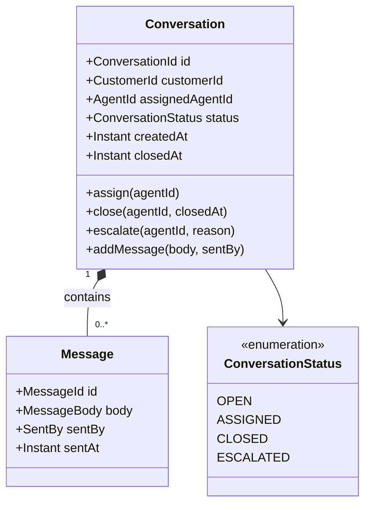

# Aggregate Documentation Format

> The format for `ai26/domain/{module}/{aggregate}.md` files.

---

## Purpose

Each aggregate has one documentation file. It serves two audiences:

- **Humans** — Mermaid class diagram for visual understanding
- **LLM** — YAML model with the complete, unambiguous definition

Both sections are always present. The YAML is the source of truth for skills.
The diagram is generated from the YAML — if they diverge, the YAML wins.

---

## File location

```
ai26/domain/{module}/{aggregate-name-kebab}.md
```

Examples:
```
ai26/domain/service/conversation.md
ai26/domain/service/agent.md
ai26/domain/application/payment.md
```

---

## Format

```markdown
# {AggregateName}

Module: {module-name}
Type: aggregate-root

---

## Diagram

```mermaid
classDiagram
  class {AggregateName} {
    +{IdType} id
    +{PropertyType} {propertyName}
    +{method}({params})
  }

  class {ChildEntity} {
    +{IdType} id
    +{PropertyType} {propertyName}
  }

  class {StatusEnum} {
    <<enumeration>>
    STATE_A
    STATE_B
  }

  {AggregateName} "1" *-- "0..*" {ChildEntity} : contains
  {AggregateName} --> {StatusEnum}
```

---

## Model

```yaml
aggregate: {AggregateName}
module: {module-name}
file: {path/to/AggregateName.kt}

properties:
  - name: id
    type: {IdType}
  - name: {propertyName}
    type: {PropertyType}
    nullable: false          # omit if false, include explicitly if true

states:
  - STATE_A
  - STATE_B
  - STATE_C

transitions:
  - from: STATE_A
    to: STATE_B
    method: {methodName}
  - from: STATE_B
    to: STATE_C
    method: {methodName}

invariants:
  - "{Invariant expressed as a business rule, not as code}"
  - "{Another invariant}"

methods:
  - name: {methodName}
    params:
      - name: {paramName}
        type: {ParamType}
    emits: {DomainEventName}     # omit if method emits no event

entities:
  - name: {EntityName}
    file: {path/to/EntityName.kt}
    properties:
      - name: id
        type: {EntityIdType}
      - name: {propertyName}
        type: {PropertyType}

valueObjects:
  - name: {ValueObjectName}
    wraps: {PrimitiveType}
    constraints:
      - "{Constraint as business rule}"

domainEvents:
  - name: {EventName}
    emittedBy: {methodName}
    file: {path/to/EventName.kt}

repository:
  interface: {RepositoryInterfaceName}
  file: {path/to/RepositoryInterface.kt}
```
```

---

## Full example — Conversation aggregate

```markdown
# Conversation

Module: service
Type: aggregate-root

---

## Diagram



---

## Model

```yaml
aggregate: Conversation
module: service
file: service/src/main/kotlin/de/tech26/valium/domain/conversation/Conversation.kt

properties:
  - name: id
    type: ConversationId
  - name: customerId
    type: CustomerId
  - name: assignedAgentId
    type: AgentId
    nullable: true
  - name: status
    type: ConversationStatus
  - name: createdAt
    type: Instant
  - name: closedAt
    type: Instant
    nullable: true

states:
  - OPEN
  - ASSIGNED
  - CLOSED
  - ESCALATED

transitions:
  - from: OPEN
    to: ASSIGNED
    method: assign
  - from: ASSIGNED
    to: CLOSED
    method: close
  - from: ASSIGNED
    to: ESCALATED
    method: escalate

invariants:
  - "Only the assigned agent can close a conversation"
  - "Only the assigned agent can escalate a conversation"
  - "A closed or escalated conversation cannot receive new messages"
  - "A conversation can only be assigned to one agent at a time"

methods:
  - name: assign
    params:
      - name: agentId
        type: AgentId
    emits: ConversationAssigned
  - name: close
    params:
      - name: agentId
        type: AgentId
      - name: closedAt
        type: Instant
    emits: ConversationClosed
  - name: escalate
    params:
      - name: agentId
        type: AgentId
      - name: reason
        type: EscalationReason
    emits: ConversationEscalated
  - name: addMessage
    params:
      - name: body
        type: MessageBody
      - name: sentBy
        type: SentBy
    emits: CustomerMessageSent

entities:
  - name: Message
    file: service/src/main/kotlin/de/tech26/valium/domain/conversation/Message.kt
    properties:
      - name: id
        type: MessageId
      - name: body
        type: MessageBody
      - name: sentBy
        type: SentBy
      - name: sentAt
        type: Instant

valueObjects:
  - name: ConversationId
    wraps: UUID
  - name: CustomerId
    wraps: UUID
  - name: MessageId
    wraps: UUID
  - name: MessageBody
    wraps: String
    constraints:
      - "not blank"
      - "max 4000 characters"
  - name: EscalationReason
    wraps: String
    constraints:
      - "not blank"
      - "max 500 characters"

domainEvents:
  - name: ConversationAssigned
    emittedBy: assign
    file: service/src/main/kotlin/de/tech26/valium/domain/conversation/ConversationAssigned.kt
  - name: ConversationClosed
    emittedBy: close
    file: service/src/main/kotlin/de/tech26/valium/domain/conversation/ConversationClosed.kt
  - name: ConversationEscalated
    emittedBy: escalate
    file: service/src/main/kotlin/de/tech26/valium/domain/conversation/ConversationEscalated.kt
  - name: CustomerMessageSent
    emittedBy: addMessage
    file: service/src/main/kotlin/de/tech26/valium/domain/conversation/CustomerMessageSent.kt

repository:
  interface: ConversationRepository
  file: service/src/main/kotlin/de/tech26/valium/domain/conversation/ConversationRepository.kt
```
```

---

## Rules

- **Every state must appear in at least one transition** — if a state exists, it
  is reachable and leavable (or terminal, which must be noted in invariants).
- **Every method that changes state must have a transition** — no hidden state changes.
- **Every domain event must have an `emittedBy`** — no events without a trigger.
- **Invariants are business rules, not code** — write them as a stakeholder would
  say them, not as a guard clause.
- **nullable is only included when true** — omitting it means the field is required.
- **file paths are relative to repo root** — not to the module.
