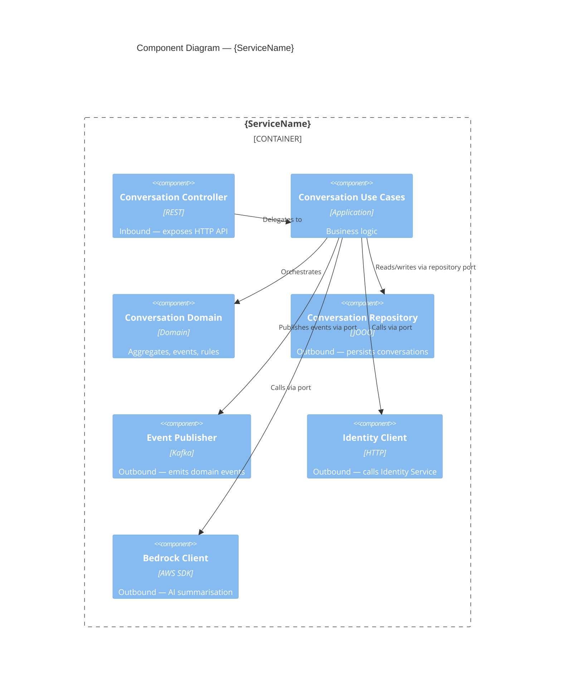

# Context Mapping

> How AI26 captures and generates system boundary documentation.

---

## What this covers

A service's boundaries — what it exposes, what it calls, what it emits, what it
consumes — are as important as its internal design. Without this information, the
LLM cannot reason about the blast radius of a change, the impact on downstream
consumers, or the coupling introduced by a new integration.

AI26 captures this in three places:

| Where | What | Who writes it |
|---|---|---|
| `ai26/context/INTEGRATIONS.md` | Live registry of all integrations — updated as features are built | Engineer (via `ai26-onboard-team` or `ai26-promote-user-story`) |
| `ai26/context/diagrams/` | C1 and C4 diagrams in Mermaid — read by skills as LLM context | LLM (generated from `INTEGRATIONS.md`, regenerated on promotion) |
| `docs/service/assets/` | C1 and C4 diagrams in Mermaid — navigable for engineers | LLM (same content, written to team convention path) |

`ai26/context/diagrams/` is the source of truth for skills. `docs/service/assets/` is the team
convention for navigable diagrams — Mermaid renders natively in GitHub and VS Code without any
additional tooling. This replaces the previous `.puml` convention.

---

## `ai26/context/INTEGRATIONS.md`

**Who reads it:** `ai26-design-epic-architecture`, `ai26-design-user-story`,
`ai26-validate-user-story`, `ai26-promote-user-story`

**What the LLM uses it for:**

- Detect when a ticket introduces a new integration that is not yet registered
- Warn when a ticket modifies an existing integration that has downstream consumers
- Inform epic architecture analysis with the current integration surface
- Generate and update C1/C4 diagrams on promotion

**Rule:** every inbound and outbound integration must have an entry here.
If an integration is not listed, the LLM will treat it as new and flag it for registration.

---

### Format

```markdown
# Integrations

---

## Inbound HTTP

| Method | Path | Description | Auth |
|---|---|---|---|
| {METHOD} | {/path} | {What this endpoint does} | {none / jwt / api-key / ...} |

---

## Outbound HTTP

### {ServiceName}

Base URL: `{base URL or config key}`
Purpose: {Why we call this service}

| Method | Path | Description |
|---|---|---|
| {METHOD} | {/path} | {What we use this call for} |

---

## Events emitted

| Event | Topic / Queue | Trigger | Schema file |
|---|---|---|---|
| {EventName} | {topic or queue name} | {What causes this event to be emitted} | `{path to schema or event file}` |

---

## Events consumed

| Event | Topic / Queue | Source service | Handler |
|---|---|---|---|
| {EventName} | {topic or queue name} | {Which service emits this} | {Use case or handler class} |

---

## AI / ML services

### {ServiceName}

Provider: {bedrock / openai / vertex / ...}
Purpose: {What we use this for}

| Model / Resource | Used for |
|---|---|
| {model-id or ARN} | {Specific use — summarisation, classification, generation, etc.} |

---

## Downstream services

Services that depend on us — either by calling our API or by consuming our events.

| Service | How it depends on us | Impact of breaking change |
|---|---|---|
| {ServiceName} | {calls /path or consumes {EventName}} | {What breaks if we change this} |
```

---

### Example

```markdown
# Integrations

---

## Inbound HTTP

| Method | Path | Description | Auth |
|---|---|---|---|
| POST | /conversations | Create a new conversation | jwt |
| GET | /conversations/{id} | Retrieve a conversation with its messages | jwt |
| POST | /conversations/{id}/messages | Send a message in a conversation | jwt |
| POST | /conversations/{id}/close | Close a conversation | jwt |
| POST | /conversations/{id}/escalate | Escalate a conversation | jwt |

---

## Outbound HTTP

### IdentityService

Base URL: `${IDENTITY_SERVICE_BASE_URL}`
Purpose: Resolve agent identity and permissions when assigning conversations.

| Method | Path | Description |
|---|---|---|
| GET | /agents/{id} | Fetch agent profile and availability |
| GET | /agents/{id}/permissions | Check if agent can accept escalations |

### NotificationService

Base URL: `${NOTIFICATION_SERVICE_BASE_URL}`
Purpose: Send customer-facing notifications when conversation state changes.

| Method | Path | Description |
|---|---|---|
| POST | /notifications | Send a notification to a customer or agent |

---

## Events emitted

| Event | Topic / Queue | Trigger | Schema file |
|---|---|---|---|
| ConversationOpened | conversations | Conversation created | `ai26/domain/service/conversation.md` |
| ConversationAssigned | conversations | Agent assigned to a conversation | `ai26/domain/service/conversation.md` |
| ConversationClosed | conversations | Conversation marked as closed | `ai26/domain/service/conversation.md` |
| ConversationEscalated | conversations | Conversation escalated to supervisor | `ai26/domain/service/conversation.md` |
| MessageSent | conversations | Message sent within a conversation | `ai26/domain/service/conversation.md` |

---

## Events consumed

| Event | Topic / Queue | Source service | Handler |
|---|---|---|---|
| AgentAvailabilityChanged | agents | AgentService | UpdateAgentAvailabilityUseCase |
| CustomerCreated | customers | CustomerService | RegisterCustomerUseCase |

---

## AI / ML services

### Amazon Bedrock — Message Summarisation

Provider: bedrock
Purpose: Generate summaries of long conversations for agent handover notes.

| Model / Resource | Used for |
|---|---|
| anthropic.claude-3-haiku-20240307-v1:0 | Conversation summarisation |
| anthropic.claude-3-sonnet-20240229-v1:0 | Escalation reason analysis |

---

## Downstream services

| Service | How it depends on us | Impact of breaking change |
|---|---|---|
| ReportingService | Consumes ConversationClosed event | Loses closed conversation data — reports will be incomplete |
| AgentDashboard | Calls GET /conversations and POST /conversations/{id}/messages | Real-time conversation view breaks |
| SLAService | Consumes ConversationOpened and ConversationClosed events | Cannot calculate SLA — all SLA tracking stops |
```

---

## C1 and C4 diagrams

C1 and C4 diagrams are **generated** from `INTEGRATIONS.md` and `ai26/context/DOMAIN.md`.
They are not hand-written. The LLM regenerates them whenever `ai26-promote-user-story`
runs and detects a change to either source file.

Generated files live in two locations:

```
ai26/context/diagrams/
  c1-system-context.md    ← C1: LLM context — read by skills on every design conversation
  c4-components.md        ← C4: LLM context — read by skills on every design conversation

docs/service/assets/
  c1-system-context.md    ← C1: navigable for engineers (Mermaid, replaces c4_context_diagram.puml)
  c4-components.md        ← C4: navigable for engineers (Mermaid, replaces c4_container_diagram.puml)
```

Both files contain identical Mermaid content. The split exists because `ai26/` is the LLM
knowledge base and `docs/service/assets/` is the team convention for navigable architecture docs.
Mermaid renders natively in GitHub and VS Code — no separate rendering step needed.

---

### C1 — System Context diagram

Shows the service as a black box: external users, downstream services, upstream services,
and external systems (APIs, AI services). No internal detail.

Generated Mermaid format:

```mermaid
C4Context
  title System Context — {ServiceName}

  Person(customer, "Customer", "{description}")
  Person(agent, "Agent", "{description}")

  System(service, "{ServiceName}", "{one-line purpose}")

  System_Ext(identityService, "Identity Service", "{description}")
  System_Ext(notificationService, "Notification Service", "{description}")
  System_Ext(bedrock, "Amazon Bedrock", "AI summarisation and analysis")

  Rel(customer, service, "Creates conversations, sends messages", "HTTPS/REST")
  Rel(agent, service, "Manages and responds to conversations", "HTTPS/REST")
  Rel(service, identityService, "Resolves agent identity", "HTTPS/REST")
  Rel(service, notificationService, "Sends notifications", "HTTPS/REST")
  Rel(service, bedrock, "Summarises conversations", "AWS SDK")
  Rel(reportingService, service, "Consumes conversation events", "Kafka")
```

---

### C4 — Component diagram

Shows the internal components of the service: bounded contexts, adapters,
external integrations, and the flows between them.

Generated Mermaid format:



---

## When diagrams are regenerated

`ai26-promote-user-story` regenerates the C1 and C4 diagrams when:

1. `INTEGRATIONS.md` has changed since the last promotion
2. `DOMAIN.md` has changed (new bounded contexts, new aggregates)

The engineer confirms the regenerated diagrams before they are committed.
The LLM does not silently overwrite existing diagrams.

---

## Keeping `INTEGRATIONS.md` accurate

`INTEGRATIONS.md` is a living document. It degrades if not maintained.

`ai26-design-user-story` detects when a ticket introduces:
- A new outbound HTTP call → prompts to add to `Outbound HTTP`
- A new event emitted → prompts to add to `Events emitted`
- A new event consumed → prompts to add to `Events consumed`
- A new AI/ML integration → prompts to add to `AI / ML services`

`ai26-promote-user-story` surfaces the proposed updates for confirmation
before writing them. The engineer reviews the diff — the LLM never updates
`INTEGRATIONS.md` silently.
