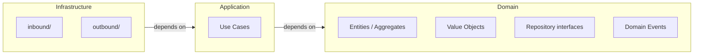

# Architecture Principles

Clean Architecture and DDD implementation for valium.

---

## Table of Contents

1. [Introduction](#1-introduction)
2. [Architectural Layers](#2-architectural-layers)
   - 2.1 [Domain Layer (Core)](#21-domain-layer-core)
   - 2.2 [Application Layer (Use Cases)](#22-application-layer-use-cases)
   - 2.3 [Infrastructure Layer (Adapters)](#23-infrastructure-layer-adapters)
3. [Dependency Rule](#3-dependency-rule)
4. [DDD Patterns](#4-ddd-patterns)
   - 4.1 [Aggregate Pattern](#41-aggregate-pattern)
   - 4.2 [Value Objects](#42-value-objects)
   - 4.3 [Entities](#43-entities)
   - 4.4 [Repository Pattern (Per Aggregate)](#44-repository-pattern-per-aggregate)
   - 4.5 [Ports and Adapters (Hexagonal Architecture)](#45-ports-and-adapters-hexagonal-architecture)
   - 4.6 [Humble Object Pattern](#46-humble-object-pattern)
   - 4.7 [Domain Events (Between Aggregates)](#47-domain-events-between-aggregates)
5. [Architecture Presets](#5-architecture-presets)
6. [Anti-Patterns](#6-anti-patterns)
   - 6.1 [Anemic Domain Model](#61-anemic-domain-model)
   - 6.2 [Large Aggregates](#62-large-aggregates)
   - 6.3 [Cross-Aggregate Transactions](#63-cross-aggregate-transactions)
   - 6.4 [Infrastructure Leakage into Domain](#64-infrastructure-leakage-into-domain)
7. [Observability — Where Logs and Metrics Belong](#7-observability--where-logs-and-metrics-belong)
8. [Evolution](#8-evolution)
   - 8.1 [Adding a New Aggregate](#81-adding-a-new-aggregate)
   - 8.2 [Splitting a Large Aggregate](#82-splitting-a-large-aggregate)
   - 8.3 [Migrating Legacy Code](#83-migrating-legacy-code)

---

## 1. Introduction

If you are new to Clean Architecture: the core idea is that your business logic should not depend on anything external — not on Spring, not on the database, not on HTTP. External concerns depend on the business logic, not the other way around. In practice this means your domain layer is pure Kotlin: no annotations, no framework imports, just plain classes that model your problem. Here is why that matters:

- **Swappability** — You can change your database or your web framework without touching the code that implements your business rules. The domain does not know what persists it.
- **Testability** — Domain and use case tests run in milliseconds without starting Spring, databases, or containers. Mocks replace infrastructure ports trivially.
- **Onboarding speed** — A new developer can understand the business rules by reading plain Kotlin classes, without needing to learn Spring or JOOQ first.
- **Parallel team work** — The port interface is the only contract between layers, so one developer builds the domain and use case while another implements the infrastructure adapter.
- **Deferred decisions** — You can start building business logic before choosing a database, message broker, or cloud provider. Infrastructure choices become plug-in decisions you make when you are ready.
- **Protectability against framework churn** — A framework upgrade (Spring Boot 2→3, Jakarta migration) only touches the infrastructure layer. Domain and application code remain untouched.
- **Controlled blast radius** — A breaking change in an external API — LivePerson, Stripe, whatever — is contained to a single adapter file. No business logic needs to change.
- **Domain focus** — The architecture forces you to model the problem space first and technology second, leading to richer domain models instead of CRUD wrappers around database tables.
- **Explicit dependencies** — Constructor injection of ports makes every external dependency visible in the class signature. No hidden coupling via static calls or service locators.
- **Easier debugging** — The layers tell you where to look: if the bug is in business logic, it is in domain or application; if it is in persistence, it is in infrastructure.
- **Deterministic behavior** — Domain classes are pure functions with no I/O, so their behaviour is reproducible — easy to reason about in code reviews, easy to verify in tests.
- **Reusability across entry points** — Use cases have no knowledge of their caller, so the same use case serves an HTTP controller, an SQS listener, a CLI command, or a scheduled job without duplication.

For module organisation and folder layout, see [Project Structure](./project-structure.md).
For testing strategy, see [Testing Strategy](./testing-strategy.md).

### Foundational reading {#foundational-reading}

The patterns in this document draw from a small set of books. You don't need to read them cover to cover before writing code — the standards and cookbook give you the practical shapes — but understanding the *why* behind the patterns makes the rules feel obvious instead of arbitrary.

| Book | Author | What it gives you |
|---|---|---|
| *Clean Architecture* | Robert C. Martin (2017) | The dependency rule, layers, and the principle that business logic must not depend on frameworks. This is the structural backbone of the project. |
| *Domain-Driven Design* | Eric Evans (2003) | Aggregates, entities, value objects, repositories, bounded contexts. The tactical patterns we use in the domain layer come from here. |
| *Implementing Domain-Driven Design* | Vaughn Vernon (2013) | Practical application of Evans' patterns — aggregate design rules, repository contracts, domain events. More concrete than the original. |
| *xUnit Test Patterns* | Gerard Meszaros (2007) | Test doubles, Object Mothers, Creation Methods, the vocabulary for talking about test design. The testing strategy references this directly. |
| *Growing Object-Oriented Software, Guided by Tests* | Steve Freeman & Nat Pryce (2009) | TDD outside-in, ports and adapters in practice, the London school of testing. Explains the testing approach we follow. |
| *Domain Modeling Made Functional* | Scott Wlaschin (2018) | The book that best explains the pattern we follow: `Either` for errors, value objects that make illegal states unrepresentable, primitive obsession as anti-pattern. Written in F# but the ideas translate directly to Kotlin. If someone on the team doesn't understand why `Either` instead of exceptions, this book explains it better than anyone. |
| *Get Your Hands Dirty on Clean Architecture* | Tom Hombergs (2019) | Clean Architecture applied specifically to Spring Boot. Use cases as `@Service`, ports in domain, adapters in infrastructure — practically what we do. More concrete, less philosophical than Martin. |


If you read only two, read Martin for the architecture and Evans for the domain modeling.

---

## 2. Architectural Layers

### 2.1 Domain Layer (Core)

**Responsibility**: Pure business logic — entities, aggregates, value objects, domain events, repository interfaces.

Constraints:
- No framework annotations (`org.springframework.*`, `jakarta.persistence.*`, `org.jooq.*`)
- No external dependencies
- Repository interfaces defined here (ports), implemented in infrastructure

The constraint "no framework annotations" is not about purism — it is about what it costs to run a test. If a domain class has persistence annotations, Spring needs to be started to instantiate it, which means a database connection, which means containers, which means every domain test takes seconds instead of milliseconds. Keeping domain classes annotation-free means you can run hundreds of domain tests in under a second, anywhere, without any infrastructure. The repository interface is declared in the domain layer for the same reason: the domain says "I need something that can save a Conversation" — it does not care whether that something uses JOOQ, an in-memory map, or some other persistence technology. The infrastructure provides the implementation.

**Aggregate root — correct pattern** (private constructor + `companion object { fun create(...) }`):
```kotlin
class Conversation private constructor(
    val id: ConversationId,
    val customerId: String,
    val subject: String,
    val status: ConversationStatus,
    val createdAt: LocalDateTime
) {
    init {
        require(customerId.isNotBlank()) { "Customer ID cannot be blank" }
        require(subject.isNotBlank()) { "Subject cannot be blank" }
    }

    companion object {
        fun create(customerId: String, subject: String): Conversation {
            return Conversation(
                id = ConversationId.new(),
                customerId = customerId,
                subject = subject,
                status = ConversationStatus.OPEN,
                createdAt = LocalDateTime.now()
            )
        }
    }

    fun close(): Either<CloseError, Conversation> {
        if (status != ConversationStatus.OPEN) return Either.Error(CloseError.AlreadyClosed(id))
        return Either.Success(copy(status = ConversationStatus.CLOSED))
    }

    sealed class CloseError {
        data class AlreadyClosed(val id: ConversationId) : CloseError()
    }

    fun toSnapshot(): ConversationSnapshot = ConversationSnapshot(
        conversationId = id.id,
        customerId = customerId,
        subject = subject,
        status = status.name,
        createdAt = createdAt
    )

    fun toDTO(): ConversationDto = ConversationDto(
        id = id.id.toString(),
        customerId = customerId,
        subject = subject,
        status = status.name,
        createdAt = createdAt.toString()
    )

    private fun copy(
        status: ConversationStatus = this.status
    ) = Conversation(id, customerId, subject, status, createdAt)
}
```

A few things worth explaining in this aggregate:
- The constructor is `private` so no code outside this class can create a `Conversation` in an arbitrary state. The `init` block enforces invariants (`customerId` non-blank, `subject` non-blank) on every construction path — factory, rehydration, test.
- `create()` is in a `companion object` (Kotlin's equivalent of a static factory method) because you call it on the class, not on an instance: `Conversation.create(...)`.
- `close()` returns `Either<CloseError, Conversation>`: the business check (must be OPEN) is a value, not an exception. The immutable copy prevents accidental state leaks.
- The private `copy()` method at the bottom is intentional: it prevents callers from using Kotlin's built-in destructuring to produce a modified copy bypassing the business methods.
- `toSnapshot()` builds a primitives-only snapshot for domain events. `toDTO()` builds a representation for HTTP responses. They may carry the same fields today but serve different consumers and evolve independently.
- The aggregate does **not** collect events internally. The use case builds the event after save: `eventEmitter.emit(ConversationEvent.Created(snapshot = saved.toSnapshot()))`. See [Domain Events — ECST Pattern](./domain-events.md) for the full event design.

**Repository interface (port)**:
```kotlin
interface ConversationRepository {
    fun save(conversation: Conversation): Conversation
    fun findById(id: ConversationId): Conversation?
    fun findByCustomerId(customerId: String): List<Conversation>
    // No methods for child entities — access only through the aggregate root
}
```

The repository interface uses only domain types (`ConversationId`, `Conversation`) — it has no `Optional` and no JOOQ record. This keeps the domain completely isolated from persistence technology. The rule "no methods for child entities" means if `Order` has child `OrderItem` entities, there is no `OrderItemRepository` — you always go through `OrderRepository` to load the order and access its items. This enforces the aggregate boundary: items only make sense in the context of an order, and the only way to change them is through the order root.

**Value object** — use private constructor + factory when the valid value space is narrower than the input type (e.g. `String` → `Email`). Use public constructor when the input type already constrains all values (e.g. `UUID` → `ConversationId`):

```kotlin
// Public constructor — every UUID is a valid ConversationId, nothing to validate
data class ConversationId(val id: UUID) {
    fun value(): String = id.toString()
    override fun toString(): String = value()

    companion object {
        fun new(): ConversationId = ConversationId(UUID.randomUUID())
    }
}

// Private constructor — not every String is a valid Email
data class Email private constructor(val value: String) {
    companion object {
        fun of(email: String): Either<ValidationError, Email> {
            return when {
                email.isBlank() -> Either.Error(ValidationError("Email cannot be blank"))
                !email.contains("@") -> Either.Error(ValidationError("Invalid email format"))
                else -> Either.Success(Email(email.lowercase().trim()))
            }
        }
    }
}
```

### 2.2 Application Layer (Use Cases)

**Responsibility**: Orchestrate business logic. Coordinate aggregates and domain services. Manage transaction boundaries. Publish domain events.

Constraints:
- `@Service` and `@Transactional` are the only permitted framework annotations
- No presentation logic
- No direct infrastructure access (use ports)
- Parameters are **primitives only** (`String`, `Int`, `UUID`, `List<String>`, …) — never domain types, DTOs, or command objects. Inside the use case, immediately wrap primitives into domain types and validate.
- Returns `Either<DomainError, DTO>`

The use case is the heart of the system and the primary thing you test. It does one thing: orchestrate. Load an aggregate from the repository, call the domain method that enforces the business rule, save the result, publish any events, return a DTO. There is no business logic in the use case itself — that belongs in the aggregate. There is no HTTP logic — that belongs in the controller. The thinness of the use case is what makes it easy to unit-test with a simple mock: you mock the repository, call the use case, assert on the return value.

`Either<DomainError, DTO>` is the return type instead of throwing exceptions because exceptions are invisible in method signatures. If the method throws `ConversationNotFoundException`, the controller has to know which exception to catch — a coupling that is not expressed in any type. `Either` makes the failure path explicit: the return type tells you that success and failure are both possible, and forces the caller to handle both. The `Left` side carries the domain error; the `Right` side carries the result.

```kotlin
@Service
@Transactional
class CreateConversationUseCase(
    private val conversationRepository: ConversationRepository,
    private val eventEmitter: ConversationEventEmitter
) {
    operator fun invoke(customerId: String, subject: String): Either<CreateConversationDomainError, ConversationDto> {
        val conversation = Conversation.create(
            customerId = customerId,
            subject = subject
        )

        val saved = conversationRepository.save(conversation)

        eventEmitter.emit(ConversationEvent.Created(snapshot = saved.toSnapshot()))

        return Either.Success(saved.toDTO())
    }
}
```

Notice: parameters are plain primitives (`String`, `UUID`). The use case is the application boundary — primitives keep domain types from leaking outward. Inside the use case, primitives are immediately wrapped into domain types (`Conversation.create` handles that here). `@Service` and `@Transactional` are the only Spring annotations present. `@Transactional` belongs here — not on the repository, not on the controller — because the use case defines the unit of work. The event is built **after** save using `toSnapshot()` — see [Domain Events — ECST Pattern](./domain-events.md).

```kotlin
// Models only expected business alternatives — no input validation, no HTTP, no infra failures
sealed class CreateConversationDomainError {
    data class CustomerNotFound(val customerId: UUID) : CreateConversationDomainError()
    // ❌ InvalidInput(val reason: String) — input validation belongs in the controller, not the domain
}
```

The sealed class enumerates every *expected business alternative* — situations where the operation cannot proceed due to a legitimate domain condition, not a programmer error or an input parsing failure. Input validation (blank fields, invalid UUIDs) belongs in the controller, not here. The compiler forces the controller to handle every variant exhaustively via `when` — there is no way to forget a case.

**Use cases talk to the aggregate root, never its children.** The use case's only "neighbor" is the root — reaching through it into `conversation.getBlocks().first().updateStatus()` violates both the aggregate boundary and the Law of Demeter. If the use case needs something that lives inside the aggregate, the root exposes a method that does it and returns the result: `conversation.updateBlockStatus(blockId, newStatus)`. The use case tells the aggregate *what* to do; the aggregate decides *how*. This is Tell Don't Ask at the architectural level, and it is the reason aggregates have behaviour instead of just getters.

### 2.3 Infrastructure Layer (Adapters)

**Responsibility**: Concrete implementations of ports. Framework configuration. External services.

Constraints:
- Must be in `inbound/` (controllers, request handlers) or `outbound/` (repositories, external API clients)
- Nothing flat in `infrastructure/` — always a sub-package

The `inbound/` and `outbound/` separation is not cosmetic. `inbound/` contains code that is called by the outside world (HTTP requests, SQS messages, event listeners). `outbound/` contains code that calls the outside world (databases, external APIs, SQS publishers). Keeping them separate makes the direction of dependency immediately visible in the folder structure.

**When infrastructure must go through a use case:**
Any operation that involves business rules, domain state changes, or decisions that the domain owns **must** delegate to a use case. Controllers, SQS subscribers, and event listeners that trigger business logic always follow the pattern: parse → call use case → translate result.

**When infrastructure can coordinate directly (no use case):**
Pure operational concerns — dead-letter queue redrives, metric collection, health checks, certificate rotation, scheduled retries — have no business rules and no domain state. Creating an empty use case for these adds a layer with no value. In these cases, an `inbound/` component (e.g., a scheduler) may call an `outbound/` component (e.g., a redrive processor) directly.

The decision criterion is simple: **does the operation involve domain logic?** If yes → use case. If it is pure infrastructure plumbing → direct coordination is acceptable.

Examples from the codebase:

| Component | Pattern | Use case? | Why |
|---|---|---|---|
| `SQSConversationAnalysisSubscriber` | Subscriber → `AnalyseConversation` | Yes | Business logic: NLP analysis, domain state update |
| `CertificatePinningKeysUpdateScheduler` | Scheduler → use case | Yes | Domain logic: validate and store public keys |
| `ConversationCloseRedriveScheduler` | Scheduler → `SQSConversationCloseRedrive.reprocess()` | No | Pure plumbing: move messages from DLQ back to main queue |
| `MetricService` | Wraps Micrometer | No | Cross-cutting infrastructure concern, no domain involvement |

**Humble controller** (no logic — only HTTP translation):
```kotlin
@RestController
@RequestMapping("/api/conversations")
class ConversationController(private val createConversation: CreateConversationUseCase) {

    @PostMapping
    fun create(@RequestBody @Valid request: CreateConversationRequest): ResponseEntity<ConversationResponse> {
        return when (val result = createConversation(request.customerId, request.subject)) {
            is Either.Success -> ResponseEntity.status(HttpStatus.CREATED).body(ConversationResponse.from(result.value))
            is Either.Error   -> throw result.value.toResponseStatusException()
        }
    }

    private fun CreateConversationDomainError.toResponseStatusException() = when (this) {
        is CreateConversationDomainError.CustomerNotFound -> ResponseStatusException(HttpStatus.NOT_FOUND)
        is CreateConversationDomainError.InvalidInput     -> ResponseStatusException(HttpStatus.UNPROCESSABLE_ENTITY)
    }
}
```

The controller does exactly three things: parse and validate input, call the use case, translate the result to HTTP. There is no business logic. The `when` block is the entire logic: if the use case returned `Either.Success`, build a 201 response; if it returned `Either.Error`, throw a `ResponseStatusException` with the right status code. There is no intermediate `ApplicationException` class — the controller maps the use case's sealed error directly to `ResponseStatusException`. This keeps the error mapping local to the controller, where HTTP concerns belong.

**JOOQ repository (adapter)**:
```kotlin
@Repository
class JooqConversationRepository(
    private val dsl: DSLContext,
) : ConversationRepository {

    override fun save(conversation: Conversation): Conversation {
        dsl.insertInto(CONVERSATION_V2)
            .set(CONVERSATION_V2.ID, conversation.id)
            .set(CONVERSATION_V2.CUSTOMER_ID, conversation.customerId)
            .set(CONVERSATION_V2.STATUS, conversation.status.toJooq())
            .execute()
        return conversation
    }

    override fun findById(id: ConversationId): Conversation? =
        dsl.selectFrom(CONVERSATION_V2)
            .where(CONVERSATION_V2.ID.eq(id.value))
            .fetchOne()
            ?.toDomain()

    private fun ConversationV2Record.toDomain() = Conversation.from(
        id = id,
        customerId = customerId,
        status = status.toDomain(),
        // ...
    )

    private fun ConversationStatus.toJooq() = ConversationV2Status.valueOf(name)
    private fun ConversationV2Status.toDomain() = ConversationStatus.valueOf(name)
}
```

The repository adapter has two responsibilities: translate from domain to JOOQ types on save (e.g. `conversation.status.toJooq()`), and translate back from JOOQ records to domain objects on load (`record.toDomain()`). These are the only things it does. Private extension functions keep the mapping co-located with the adapter. If the mapping is wrong — a nullable column mapped to a non-null Kotlin field, an enum stored as the wrong type — the integration test catches it because it runs against a real PostgreSQL container.

---

## 3. Dependency Rule

Dependencies flow inward toward the domain. Inner layers know nothing about outer layers.



- **Domain**: depends on nothing
- **Application**: depends on Domain only
- **Infrastructure**: depends on Application and Domain

Why does this matter in practice?

- **Swap persistence** — Rewrite `infrastructure/outbound/` and nothing else changes. The domain and use cases are identical.
- **Add a new endpoint** — Write a new controller in `infrastructure/inbound/` and potentially a new use case. The domain model does not change.
- **Resilience to change** — The most volatile parts (frameworks, databases, HTTP libraries) depend on the most stable parts (business rules), not the other way around.

**References on the Dependency Rule:**

- Martin, Robert C. — [The Clean Architecture](https://blog.cleancoder.com/uncle-bob/2012/08/13/the-clean-architecture.html) (2012) — the original blog post that introduced the concentric circles diagram and formalised the dependency rule.
- Martin, Robert C. — *Clean Architecture* (2017), ch. 22 "The Clean Architecture" — the book-length treatment, with the dependency rule as the central organising principle.
- Cockburn, Alistair — [Hexagonal Architecture](https://alistair.cockburn.us/hexagonal-architecture/) (2005) — the ports-and-adapters pattern that predates and inspired Clean Architecture. The dependency rule is implicit: adapters depend on ports, never the reverse.
- Freeman, Steve & Pryce, Nat — *Growing Object-Oriented Software, Guided by Tests* (2009), ch. 2 "Test-Driven Development with Objects" — shows how the dependency rule enables testability by making infrastructure swappable via ports.
- Hombergs, Tom — *Get Your Hands Dirty on Clean Architecture* (2019), ch. 3 "Organizing Code" — the dependency rule applied to Spring Boot with Gradle module enforcement.
- Wlaschin, Scott — [Functional Architecture: Ports and Adapters](https://www.youtube.com/watch?v=US8QG9I1XW0) (NDC London, 2018) — explains the dependency rule from a functional programming perspective, with the "onion" as pure core surrounded by impure shell.

---

## 4. DDD Patterns

Domain-Driven Design provides a set of tactical patterns for organising code around business concepts. These patterns are not arbitrary structure — each one solves a specific problem in modelling complex domains. Understanding what problem each pattern solves is more important than memorising its implementation.

### 4.1 Aggregate Pattern

An **aggregate** is a cluster of domain objects that must be consistent together. The **aggregate root** is the single entry point — all external access goes through it, and it enforces the invariants that keep the cluster valid.

The concept comes from Eric Evans: *"Cluster the entities and value objects into aggregates and define boundaries around each. Choose one entity to be the root of each aggregate, and control all access to the objects inside the boundary through the root."*

The key insight is the **consistency boundary**. Inside an aggregate, everything is immediately consistent — the root guarantees that. Between aggregates, consistency is **eventual** — they communicate through events, not direct references. Getting this boundary right is the hardest and most consequential design decision.

**Rules:**

- **One aggregate per transaction.** If an operation needs to modify both a `Conversation` and a `Customer`, you do not save both in one `@Transactional` call. You save one, emit an event, and let a separate listener handle the other in its own transaction. This is eventual consistency. It feels uncomfortable at first, but it is the correct model for independent concepts — `Customer` and `Conversation` should not be coupled by a shared transaction.

  This rule is the bridge between DDD and **event-driven architecture**. Once you accept that aggregates communicate through events instead of shared transactions, you're already thinking in event-driven terms. The events that flow between aggregates within a service are the same conceptual pattern as events that flow between services via Kafka or SQS — the transport changes, the principle doesn't. A well-designed aggregate boundary naturally produces a system where components are decoupled, failures are isolated, and operations can be retried independently. Event-driven architecture is not something you bolt on later — it emerges from respecting aggregate boundaries.

- **External references by ID only.** `Order` holds `customerId: UUID`, not `customer: Customer`. If `Order` held a reference to `Customer`, loading an `Order` would also load the `Customer`, creating an implicit coupling between two aggregates. By holding only the ID, the aggregate boundary stays clean: the `Order` says "this order belongs to customer X" without needing to know anything else about what a customer is.

- **Repository per aggregate root.** Child entities inside the aggregate have no repository. `OrderItem` is always loaded and saved through `Order`. This forces all modifications to go through the root, which enforces the invariants.

**How to identify an aggregate:**

Ask: *"What data must always be consistent together?"* If a `Conversation` has `ConversationBlocks`, and a block cannot exist without a conversation, and the conversation must know about all its blocks at all times — they're one aggregate with `Conversation` as root. If a `Customer` and a `Conversation` are related but can exist independently and don't need to be saved in the same transaction — they're separate aggregates.

A common mistake is making the aggregate too large. If loading the aggregate requires loading hundreds of child entities, or if two teams frequently modify different parts of the same aggregate for unrelated reasons, the boundary is probably too wide. See [Splitting a Large Aggregate](#splitting-a-large-aggregate) below.

**Collections inside an aggregate — the N+1 problem:**

A `Conversation` has N messages. A `Order` has N items. The aggregate pattern says children belong to the root and are loaded together — but loading 10,000 messages every time you need to close a conversation is a performance problem, not a modelling virtue.

The question to ask is: *"Does the root need to know about all children to enforce its invariants?"* If the answer is no, the children are probably a separate aggregate.

In practice there are three strategies, from most to least preferred:

1. **Split into separate aggregates.** If `Message` can exist independently and the `Conversation` root doesn't enforce invariants over the full message list, make `Message` its own aggregate with `conversationId: UUID` as a reference. The `Conversation` doesn't hold a `List<Message>` — it doesn't need to. This is the cleanest solution and the one we prefer.

2. **Lazy-load the collection at the infrastructure level.** The domain model keeps the `List<Message>` but the JOOQ adapter only loads it when accessed. This preserves the aggregate model but adds infrastructure complexity and risks N+1 queries. Use this only when the invariants genuinely require the full list.

3. **Paginate or limit at the repository level.** Add specific query methods (`findRecentMessages(conversationId, limit)`) that return a subset. This works for read-heavy use cases but doesn't help with write operations where the aggregate needs the full state.

Strategy 1 is the default choice. If you find yourself reaching for strategies 2 or 3, revisit whether the children truly belong inside the aggregate boundary.

**References on aggregates:**

- Evans, Eric. *Domain-Driven Design* (2003), ch. 6 "Aggregates" — the original definition of aggregates, roots, and consistency boundaries.
- Vernon, Vaughn. — [Effective Aggregate Design](https://www.dddcommunity.org/library/vernon_2011/) (2011) — three-part series on aggregate sizing rules: small aggregates, reference by ID, eventual consistency. The most practical guide to getting boundaries right.
- Vernon, Vaughn. — *Implementing Domain-Driven Design* (2013), ch. 10 "Aggregates" — expanded treatment with concrete examples of splitting large aggregates and enforcing invariants.
- Fowler, Martin. — [DDD_Aggregate](https://martinfowler.com/bliki/DDD_Aggregate.html) (2003) — concise bliki entry summarising the pattern and its relationship to transactions.
- Evans, Eric. — [DDD Reference](https://www.domainlanguage.com/ddd/reference/) (2015) — the official pattern summary card, useful as a quick refresher on aggregate rules.

### 4.2 Value Objects

A **value object** has no identity — two value objects with the same data are equal. It represents a concept defined entirely by its attributes: an `Email`, a `Money`, a `ConversationId`.

Value objects solve **primitive obsession**: instead of passing `String` everywhere and hoping it's a valid email, you wrap it in `Email` which validates on construction. The type system then makes it impossible to pass an email where a phone number is expected.

In Kotlin, value objects are `data class` — equality by value is built in. When the valid value space is narrower than the input type (e.g. `String` → `Email`), use a private constructor with a factory that returns `Either`. When the input type already constrains all possible values (e.g. `UUID` → `ConversationId`), a public constructor is fine.

See the [How-To Cookbook](./how-to.md) for the full template and anti-patterns.

**References on primitive obsession:**

- Fowler, Martin. *Refactoring* (2nd ed, 2018) — the smell is called "Primitive Obsession" (ch. 3) and the refactoring "Replace Primitive with Object" (ch. 7). This is where the name was popularised (first edition, 1999).
- C2 Wiki (Ward Cunningham) — [original entry for the term](https://wiki.c2.com/?PrimitiveObsession), from the Smalltalk community in the 90s.
- Refactoring.guru — [visual explanation of the smell](https://refactoring.guru/smells/primitive-obsession) and its refactorings.
- Rainsberger, J.B. — "Primitive Obsession Obsession" (blog, 2015) — discusses when wrapping is worth it and when it isn't, a useful counterbalance to avoid over-applying the pattern.
- Evans, Eric. *Domain-Driven Design* (2003) — doesn't use the term "primitive obsession" but solves the same problem with Value Objects (ch. 5).

**References on value objects:**

- Evans, Eric. *Domain-Driven Design* (2003), ch. 5 "Value Objects" — the original definition: no identity, equality by attributes, immutability.
- Fowler, Martin. — [ValueObject](https://martinfowler.com/bliki/ValueObject.html) (2016) — concise bliki entry clarifying the pattern and common misunderstandings about identity vs. equality.
- Vernon, Vaughn. — *Implementing Domain-Driven Design* (2013), ch. 6 "Value Objects" — practical implementation guidance including persistence strategies for value objects.
- Wlaschin, Scott. — *Domain Modeling Made Functional* (2018), ch. 3 "Domain Modeling with Types" — the strongest case for using types to make illegal states unrepresentable, directly applicable to Kotlin `data class` with private constructors.
- Millett, Scott & Tune, Nick. — *Patterns, Principles, and Practices of Domain-Driven Design* (2015), ch. 7 "Value Objects" — covers value object equality, side-effect-free behaviour, and when to use them vs. entities.

### 4.3 Entities

An **entity** has identity — two entities with the same data but different IDs are different. An entity has a lifecycle: it's created, it changes state over time, and it may be deleted. `Conversation`, `Order`, `User` are entities.

The distinction matters for equality: value objects compare by value (`Money(10, EUR) == Money(10, EUR)`), entities compare by ID (`conversation1.id == conversation2.id` regardless of other fields). In Kotlin, **aggregate roots are not `data class`** precisely because `data class` generates `equals()` based on all fields, which is wrong for entities with identity.

**References on entities:**

- Evans, Eric. *Domain-Driven Design* (2003), ch. 5 "Entities" — the original definition: identity, continuity, and lifecycle as the distinguishing traits.
- Fowler, Martin. — [EvansClassification](https://martinfowler.com/bliki/EvansClassification.html) (2003) — explains the entity vs. value object distinction and why it matters for `equals()` implementations.
- Vernon, Vaughn. — *Implementing Domain-Driven Design* (2013), ch. 5 "Entities" — practical guidance on identity generation, equality by ID, and why entities should not be `data class` equivalents.
- Wlaschin, Scott. — *Domain Modeling Made Functional* (2018), ch. 4 — shows how to model entities with identity separately from their attributes, reinforcing the immutable-entity-with-ID approach we use.

### 4.4 Repository Pattern (Per Aggregate)

A **repository** provides a collection-like interface for loading and saving aggregates. The interface lives in the domain layer (it's a port); the implementation lives in infrastructure (it's an adapter).

```kotlin
interface OrderRepository {
    fun save(order: Order): Order
    fun findById(id: OrderId): Order?
    fun findByCustomerId(customerId: String): List<Order>
    // NOT: OrderItemRepository — violates aggregate boundary
}
```

The comment `// NOT: OrderItemRepository` deserves emphasis. If `OrderItem` is a child entity inside `Order`, it has no repository of its own. You always load the `Order` and access its items through the root. This enforces the aggregate boundary: the only way to add, remove, or update an item is through the `Order`, which can enforce its invariants (e.g. minimum order amount, maximum item count).

Repositories return domain objects, never ORM entities or DTOs. They return `T?` for single lookups (null means not found) and `List<T>` for queries. They never return `Either` — infrastructure failures propagate as exceptions.

**References on the repository pattern:**

- Evans, Eric. *Domain-Driven Design* (2003), ch. 6 "Repositories" — the original definition: a collection-like interface that encapsulates storage, retrieval, and search of aggregates.
- Fowler, Martin. — [Repository](https://martinfowler.com/eaaCatalog/repository.html) (*Patterns of Enterprise Application Architecture*, 2002) — the pattern catalogue entry that predates Evans and frames the repository as a mediator between domain and data-mapping layers.
- Vernon, Vaughn. — *Implementing Domain-Driven Design* (2013), ch. 12 "Repositories" — practical guidance on repository interfaces per aggregate, collection-oriented vs. persistence-oriented styles, and testing strategies.
- Hombergs, Tom. — *Get Your Hands Dirty on Clean Architecture* (2019), ch. 6 "Implementing a Persistence Adapter" — shows how the repository interface (port) in the domain connects to its JOOQ/JPA adapter in infrastructure, which is the exact pattern we follow.

### 4.5 Ports and Adapters (Hexagonal Architecture)

The hexagonal architecture separates the application into **inside** (domain + application) and **outside** (infrastructure). The boundary between them is defined by **ports** — interfaces that declare what the inside needs from the outside.

- **Ports**: Interfaces defined in domain or application (`ConversationRepository`, `PaymentGateway`, `ConversationClosedEmitter`)
- **Adapters**: Concrete implementations in infrastructure (`JooqConversationRepository`, `StripePaymentGateway`, `SqsConversationClosedEmitter`)

The direction matters. The inside defines the port; the outside provides the adapter. This means you can swap the adapter (change from JOOQ to another persistence technology) without changing the domain or application code. In practice you rarely swap databases, but the real benefit is testability: in tests, you replace the adapter with a mock or in-memory implementation.

### 4.6 Humble Object Pattern

Controllers and repository adapters are "humble objects":
- No business logic
- Only translate between layers (HTTP ↔ command, entity ↔ domain object)
- If a controller needs complex logic, it is a design smell

A useful test for whether something belongs in a controller: "Would this logic need to change if I switched from HTTP to a CLI or a message queue?" If yes, it belongs in the use case or domain, not the controller.

### 4.7 Domain Events (Between Aggregates)

A **domain event** records that something meaningful happened in the domain. It is named in the **past tense** — `ConversationEvent.Created`, `ConversationEvent.Closed`, `OrderEvent.Confirmed` — because it describes a fact that already occurred. Events are **immutable** and carry a **full snapshot** of the aggregate's state at the moment of the transition — this is the **Event-Carried State Transfer (ECST)** pattern.

Domain events are the mechanism that makes eventual consistency between aggregates work. The pattern flows like this:

```
Aggregate A (Use Case)          Infrastructure           Aggregate B (Listener)
        │                            │                           │
        ├── business operation       │                           │
        ├── save(aggregateA)  ──────►│                           │
        ├── emit(DomainEvent) ──────►│                           │
        │                            ├── deliver event ─────────►│
        │                            │                           ├── load aggregate B
        │                            │                           ├── business operation
        │                            │                           ├── save(aggregateB)
        │                            │                           │
   ◄── transaction A commits        │              transaction B commits ──►
```

Aggregate A saves itself and emits an event in its transaction. Aggregate B receives the event in a **separate transaction** and applies its own logic. If B fails, A is not rolled back — they are independent. This is the "one aggregate per transaction" rule in action.

**Why events instead of direct calls?** If `CloseConversation` use case directly called `UpdateCustomerStats` in the same transaction, the two aggregates would be coupled: a bug in stats calculation would prevent conversations from closing. With events, `CloseConversation` does its job and emits `ConversationEvent.Closed`. If the stats listener fails, the conversation is still closed — the listener retries independently.

Beyond decoupling, there is a **data mandate**: every domain event must be published to the Lakehouse via Kafka. This is how the data platform builds analytics, audit trails, and ML pipelines — they consume the same events that drive the system's behaviour. That makes it critical to understand what an aggregate is, what constitutes a domain event, and how to emit them correctly through Kafka. If an event is malformed, missing, or duplicated, the Lakehouse gets a corrupted view of the business. Implementation details of the Kafka integration are out of scope for this document, but the contract is simple: every state transition that matters to the business produces a domain event, and every domain event reaches Kafka.

**Event structure — sealed hierarchy with ECST snapshot:**

Each aggregate has **one sealed class** that enumerates every event it can produce. Each variant carries a `ConversationSnapshot` — a `data class` of primitives representing the aggregate's full state. Consumers never need to call back to the source.

```kotlin
// domain/events/ConversationEvent.kt — sealed hierarchy, one per aggregate
sealed class ConversationEvent {
    abstract val eventId: UUID
    abstract val occurredAt: Instant
    abstract val snapshot: ConversationSnapshot

    data class Created(
        override val eventId: UUID = UUID.randomUUID(),
        override val occurredAt: Instant = Instant.now(),
        override val snapshot: ConversationSnapshot,
    ) : ConversationEvent()

    data class Closed(
        override val eventId: UUID = UUID.randomUUID(),
        override val occurredAt: Instant = Instant.now(),
        override val snapshot: ConversationSnapshot,
    ) : ConversationEvent()
}

// domain/events/ConversationSnapshot.kt — primitives only, no domain types
data class ConversationSnapshot(
    val conversationId: UUID,
    val customerId: UUID,
    val status: String,
    val customerPlatform: String,
    val language: String,
    val startedAt: Instant,
    val updatedAt: Instant?,
)
```

Why a sealed class instead of standalone event data classes? Adding a new transition (e.g. `Queued`) adds a new sealed variant — the compiler forces every `when` block in every consumer to handle it. With standalone classes, the new event can be silently ignored.

**Emitter pattern — single port per aggregate, adapter in infrastructure:**

```kotlin
// domain/events/ConversationEventEmitter.kt — one interface per aggregate
interface ConversationEventEmitter {
    fun emit(event: ConversationEvent)  // returns Unit — infra failures throw exceptions
}

// infrastructure/outbound/OutboxConversationEventEmitter.kt — Outbox prefix on implementation
@Component
class OutboxConversationEventEmitter(
    private val transactionalOutbox: TransactionalOutbox<KafkaOutboxMessage>,
    private val protoMapper: ConversationEventProtoMapper,
) : ConversationEventEmitter {
    override fun emit(event: ConversationEvent) {
        val key = event.snapshot.conversationId.toString()
        val payload = protoMapper.toProto(event).toByteArray()
        val eventType = event::class.simpleName!!
        transactionalOutbox.storeForReliablePublishing(
            KafkaOutboxMessage(stream = TOPIC, eventPayload = payload, key = key, eventType = eventType)
        )
    }
    companion object { const val TOPIC = "valium.conversation.events.v1" }
}
```

The emitter interface lives in `domain/events/` because it is a port — the domain says "I need something that can publish this event" without knowing whether that means SQS, Kafka, or Spring's `ApplicationEventPublisher`. The implementation lives in `infrastructure/outbound/` with a transport prefix (`Outbox`, `Logging`, `Sqs`) so the interface and implementation names never clash, and the active transport is obvious from the class name. One emitter per aggregate — not one per event type. Adding a new sealed variant requires zero changes to the emitter interface.

The emitter uses a **transactional outbox** (`de.tech26.outbox`) — calling `storeForReliablePublishing()` writes to an outbox table inside the same DB transaction as the use case's `repository.save()`. A polling publisher (`PollingPublisherToKafka`) asynchronously drains the outbox to Kafka, guaranteeing at-least-once delivery without the dual-write problem. This is the same pattern used in [`n26/sopranium`](https://github.com/n26/sopranium/blob/master/src/main/kotlin/com/n26/sopranium/infrastructure/adapters/outbound/event/OutboxSubscriber.kt).

The emitter returns `Unit` — never `Either`. The outbox write is a DB operation within the existing transaction; it cannot fail independently. Kafka delivery failures are retried by the polling publisher — they never surface in the use case.

For the full design reference including snapshot rules, session metadata, Kafka topic conventions, and Protobuf mapping, see [Domain Events — ECST Pattern](./domain-events.md) and the [Proto Appendix](./domain-events-proto-appendix.md).

**When to use domain events:**

- Communication between aggregates (the primary use case)
- Triggering side effects that shouldn't block the main operation (sending notifications, updating analytics)
- Decoupling bounded contexts — context A publishes, context B subscribes, neither knows the other's internals

**When NOT to use domain events:**

- Within a single aggregate — the aggregate root coordinates its own children directly, no events needed
- For synchronous request-response flows — if the caller needs an immediate answer from the other aggregate, an event is the wrong tool (consider a domain service instead)

**References on domain events:**

- Evans, Eric. — [Domain Events](https://www.domainlanguage.com/ddd/reference/) (*DDD Reference*, 2015) — Evans added domain events to the official DDD pattern language after the original book. This is the canonical definition.
- Fowler, Martin. — [Domain Event](https://martinfowler.com/eaaDev/DomainEvent.html) (2005) — early bliki entry defining the pattern: "something that happened that domain experts care about."
- Fowler, Martin. — [Event-Carried State Transfer](https://martinfowler.com/articles/201701-event-driven.html) (2017) — the article that names and explains the ECST pattern we use: events carry the full snapshot so consumers never need to call back.
- Vernon, Vaughn. — *Implementing Domain-Driven Design* (2013), ch. 8 "Domain Events" — practical implementation of events within aggregates, including the pattern of collecting events and publishing after save.
- Richardson, Chris. — [Transactional Outbox](https://microservices.io/patterns/data/transactional-outbox.html) (*Microservices Patterns*, 2018) — the outbox pattern we use to guarantee at-least-once delivery without dual writes. The article and accompanying book chapter explain the polling publisher approach.
- Kleppmann, Martin. — *Designing Data-Intensive Applications* (2017), ch. 11 "Stream Processing" — covers event logs, exactly-once semantics, and why events should be immutable facts. The theoretical foundation for our Kafka integration.
- Brandolini, Alberto. — *Introducing EventStorming* (2021) — the workshop format for discovering domain events collaboratively. Useful context for understanding why events are named in past tense and represent business facts.
- Newman, Sam. — *Building Microservices* (2nd ed, 2021), ch. 4 "Microservice Communication Styles" and ch. 6 "Workflow" — covers event-driven communication between services, the trade-off between event-carried state transfer (full snapshot) vs. event notification (ID-only callback), and saga-based coordination via events as an alternative to distributed transactions.

---

## 5. Architecture Presets

The active preset is **hybrid**. It is the team's baseline — do not override per-feature.

| Preset | Domain annotations | Application annotations | When to use |
|---|---|---|---|
| `pure` | None | None | Strict isolation; maximum portability |
| `pragmatic` | Persistence annotations on domain entities allowed | Full Spring allowed | Faster iteration; less separation |
| `hybrid` (active) | None | `@Service`, `@Transactional` only | Balance of purity and practicality |

Current configuration (hybrid):
- Domain: zero framework imports
- Application: `@Service` + `@Transactional` permitted
- Infrastructure: full framework annotations permitted; classes in `inbound/` or `outbound/`

---

## 6. Anti-Patterns

### 6.1 Anemic Domain Model

An anemic domain model is a class that holds data but has no behaviour. It looks like an entity but behaves like a struct. The consequences compound quickly:

- **Duplicated logic.** Every use case that touches the entity re-implements the same validation and state-transition checks. When a rule changes, you hunt through multiple services to update it.
- **Broken invariants.** Without behaviour on the entity, nothing stops a caller from setting an invalid state — the object cannot protect itself. You end up with defensive checks scattered across the codebase instead of a single authoritative source.
- **Violation of Tell Don't Ask.** Callers ask for the entity's state, make a decision, and push it back. The entity becomes a passive data bag rather than an object that enforces its own rules.
- **Harder testing.** Business rules that live in services require mocking the entity's getters; rules that live on the entity can be tested with a plain function call.

The aggregate pattern solves this by making the entity responsible for enforcing its own invariants. If you find a `data class` with public mutable fields and no methods beyond getters, that is the smell.

> *"The fundamental horror of this anti-pattern is that it's so contrary to the basic idea of object-oriented design; which is to combine data and process together."* — Martin Fowler, [AnemicDomainModel](https://martinfowler.com/bliki/AnemicDomainModel.html)

```kotlin
// BAD: entity with no behaviour
data class Conversation(val id: String, var status: String)

// GOOD: aggregate root with business rules and private constructor
class Conversation private constructor(...) {
    init { require(customerId.isNotBlank()); require(subject.isNotBlank()) }
    companion object { fun create(...): Conversation { ... } }
    fun close(): Either<CloseError, Conversation> { ... }
}
```

### 6.2 Large Aggregates

Large aggregates are a performance and consistency problem. If `Customer` owns `orders`, `payments`, and `addresses`, loading a `Customer` loads all of that data every time — even when you just need to update an email address. The consequences go beyond slow queries:

- **Lock contention.** A large aggregate means a large transaction. Two concurrent requests that touch different parts of the same aggregate compete for the same row lock — throughput drops and deadlocks appear under load.
- **Shotgun changes.** Adding a field to `Order` forces you to reason about the entire `Customer` aggregate, even though orders have nothing to do with the email-update flow.
- **False consistency.** Grouping unrelated data inside one aggregate suggests they must be consistent together, when in practice they change independently and at different rates.

The fix is to identify the true consistency boundaries: *what must change together atomically?* Usually that boundary is much smaller than it first appears. Vernon's practical rule is direct: **prefer small aggregates and reference other aggregates by identity (`ID`), not by object.**

> *"Design small Aggregates. […] Limit yourself to using only one or a few Value Objects and sometimes no more than the Root Entity itself."* — Vaughn Vernon, [Effective Aggregate Design Part I](https://www.dddcommunity.org/library/vernon_2011/)

```kotlin
// BAD: too many responsibilities in one aggregate
data class Customer(
    val orders: List<Order>,      // separate aggregate
    val payments: List<Payment>,  // separate aggregate
    val addresses: List<Address>  // separate aggregate
)

// GOOD: focused aggregate
class Customer private constructor(val id: CustomerId, val email: Email) {
    companion object { fun create(email: Email): Customer { ... } }
}
```

### 6.3 Cross-Aggregate Transactions

Modifying two aggregates in one transaction creates invisible coupling between two concepts that should be independent. The problems:

- **All-or-nothing fragility.** If the transaction fails, both aggregates roll back together — but conceptually they are separate. A transient failure in loyalty-point calculation should not undo a successfully validated order confirmation.
- **Hidden coupling.** The code looks like two independent repository calls, but the shared transaction boundary means a schema change in one aggregate can break the other's performance or locking behaviour.
- **Scalability ceiling.** Distributed transactions (2PC) across services or databases are expensive and brittle. Keeping one aggregate per transaction avoids that path entirely.

The event-driven alternative is more resilient: each aggregate commits independently, and downstream effects happen via domain events. If the `Customer` loyalty-point update fails after the `Order` is confirmed, a retry mechanism processes the event again — the order stays confirmed, and the points are eventually applied. If compensation is needed, each aggregate can reverse its own change in isolation, following a saga pattern.

```kotlin
// BAD: modifying two aggregates in one transaction
@Transactional
fun confirmOrder(orderId: OrderId, customerId: CustomerId) {
    order.confirm()
    customer.addLoyaltyPoints()  // wrong — second aggregate
    orderRepository.save(order)
    customerRepository.save(customer)
}

// GOOD: one aggregate per transaction, eventual consistency via events
@Transactional
fun confirmOrder(orderId: OrderId) {
    val confirmed = order.confirm()
    orderRepository.save(confirmed)
    eventPublisher.publishEvent(OrderConfirmed(order.id, order.customerId))
}
```

### 6.4 Infrastructure Leakage into Domain

Persistence annotations in domain classes create a dependency on the persistence technology. If you want to test the domain without a database, you cannot — the domain class requires the framework to function. Keeping persistence mapping in `infrastructure/outbound/` means the domain is portable.

A quick litmus test: **look at the import statements of any file inside `domain/`.** If you see a framework package (`org.springframework`, `org.jooq`, `com.fasterxml.jackson`, `software.amazon.awssdk`), infrastructure has leaked in. Domain files should import only other domain files, the Kotlin standard library, and approved foundation libraries (e.g. Arrow for `Either`).

In practice, we use JOOQ. The generated `Record` classes and enum types live in the persistence module — they never appear in domain or application code. The JOOQ adapter uses private extension functions to translate between domain types and JOOQ types:

```kotlin
// BAD: JOOQ record type leaks into domain
class Conversation(val record: ConversationV2Record)  // domain depends on persistence

// GOOD: domain is pure, adapter maps internally
class Conversation private constructor(val id: ConversationId) { ... }  // domain

// infrastructure/outbound — mapping stays here
private fun ConversationV2Record.toDomain() = Conversation.from(id = id, ...)
private fun ConversationStatus.toJooq() = ConversationV2Status.valueOf(name)
```

The same principle applies to error handling: `ValiumApplicationException` subclasses do not belong in `application/errors/`. Mapping the domain sealed error to HTTP is a controller concern. Placing that mapping in a separate `ApplicationException` class adds an indirection layer that carries no value — the controller already has to know the sealed error variants to build the `when` block, so it can just as well map directly to `ResponseStatusException`.

---

## 7. Observability — Where Logs and Metrics Belong

Observability (logs, metrics, tracing) is an infrastructure concern, not a business concern. The same reasoning that keeps persistence types out of domain classes keeps `MetricService` and `logger.info("Creating conversation...")` out of use cases: a use case orchestrates domain logic and nothing else.

### 7.1 Why not in the use case?

At first glance, the use case seems like the natural place for logs and metrics. It is the component that knows exactly what business operation is happening, what entity is being modified, and whether the operation succeeded or failed. The reasoning goes: "the use case has the richest context, so it should be the one that logs and emits metrics."

This reasoning has a flaw. It confuses *knowing something* with *being the only one that knows it*.

#### The return value already carries the full context

Consider a use case that returns `Either<SealedError, DTO>`. On success, the caller receives the DTO with all the data it needs. On failure, the caller receives a sealed error variant like `ConversationAlreadyExists(id)` or `CustomerNotFound(customerId)`. The entire business outcome — what happened, to which entity, why it failed — is encoded in the return type.

This means whoever calls the use case has exactly the same information the use case had when it decided to return that result. There is no "extra context" that was available inside the use case and got lost on the way out. The sealed error *is* the context.

Once you see this, the argument collapses. If the caller already has all the information, then the use case is not the *only* place that can emit the metric — it is just *one* of the places. And placing observability there comes with costs.

#### The cost of observability inside the use case

**1. It violates Single Responsibility.**

A use case class should have one reason to change: when the business rules change. If you inject `MetricService`, the use case now has a second reason to change: when the monitoring requirements change (new metric names, new tags, new dashboards). The constructor grows, the method body grows, and the ratio of business logic to infrastructure noise drops. Over time, the boundary between "what this class does for the business" and "what this class does for operations" blurs.

**2. It degrades testability.**

Every dependency injected into a use case must be mocked in its tests. If `MetricService` is one of those dependencies, every test — even the one that only checks what happens when a conversation is not found — must include `justRun { metrics.increment(any()) }` in its setup. This is noise. Worse, it is *fragile* noise: if someone renames a metric from `conversation.created` to `conversation.creation`, every use case test that mocks `MetricService` breaks. The tests break not because business logic changed, but because an infrastructure label changed. Use case tests should only fail when business rules are wrong.

**3. It creates duplication.**

A controller may need to emit metrics for failures that never reach the use case — for example, a request that fails JSON validation, or an infrastructure exception that the controller catches globally. If the use case already injects `MetricService` for happy-path metrics, and the controller also injects `MetricService` for these edge cases, you end up with two components emitting metrics for the same operation across different failure paths. This is confusing to debug and easy to get wrong.

**4. It sets a precedent that erodes the boundary.**

Once a use case contains one `logger.info(...)`, the next developer sees it and adds another. Then someone adds a `metrics.increment(...)`. Then a `tracer.span(...)`. Each addition is individually small, but the cumulative effect is a use case that reads like a mix of business orchestration and operational bookkeeping. The clean boundary between "what the system does" and "how we observe it" disappears incrementally.

#### The alternative is straightforward

If the controller is the component that calls the use case and receives the `Either`, and the `Either` carries the full business outcome, then the controller is perfectly positioned to emit the correct metric. It inspects the result, emits a counter, and translates the result to HTTP. No information is lost, no extra dependency is needed in the use case, and the use case remains a pure orchestrator of domain logic.

For concerns that are truly cross-cutting — request logging, latency measurement — a servlet filter (`OncePerRequestFilter`) handles them once for all endpoints, without touching any controller or use case at all.

For adapter-level errors — a database timeout, an SQS send failure — the adapter itself is the only component with the infrastructure-specific context (the SQL error code, the HTTP status from an external API). The adapter logs its own failure before propagating the exception.

### 7.2 Where each concern lives

| Concern | Owner | Mechanism |
|---|---|---|
| HTTP latency, throughput, error rate | Micrometer auto-instrumentation | `http.server.requests` (zero code — Spring Actuator provides this) |
| Request/response logging | `OncePerRequestFilter` | One component covers all endpoints |
| Custom business metrics (e.g., conversations created, failed) | Controller | Sees the full `Either` result — emits the right counter per variant |
| Infrastructure error logging (DB down, SQS timeout) | The adapter that experienced the failure | Each adapter logs its own errors at the point of failure |
| Use case | **Nothing** | Pure orchestration of domain logic |

### 7.3 How it works in practice

The controller receives the `Either` from the use case. The `Either` is exhaustive — every business outcome is a variant. The controller maps each variant to (1) an HTTP status, (2) a metric, and (3) optionally a log. No information is lost because the sealed error carries all the context:

```kotlin
@PostMapping
fun create(@RequestBody @Valid request: CreateConversationRequest): ResponseEntity<ConversationResponse> =
    when (val result = createConversation(request.customerId, request.subject)) {
        is Either.Success -> {
            metrics.increment(ConversationCreatedMetric(SUCCESS))
            ResponseEntity.status(HttpStatus.CREATED).body(ConversationResponse.from(result.value))
        }
        is Either.Error -> {
            metrics.increment(ConversationCreatedMetric(FAILURE))
            throw result.value.toResponseStatusException()
        }
    }
```

For request/response logging, Spring provides `OncePerRequestFilter` — a servlet filter that executes exactly once per HTTP request, even if the request is internally forwarded or error-dispatched. Annotating it with `@Component` is enough: Spring Boot auto-registers it in the filter chain, so it intercepts every incoming request **before** it reaches the `DispatcherServlet` and any controller:

```
HTTP request
  → RequestLoggingFilter (measures start time)
    → DispatcherServlet
      → Controller → Use case → Response
    ← response flows back
  ← RequestLoggingFilter logs: "POST /api/conversations 201 45ms"
```

```kotlin
@Component
class RequestLoggingFilter : OncePerRequestFilter() {
    override fun doFilterInternal(
        request: HttpServletRequest,
        response: HttpServletResponse,
        filterChain: FilterChain,
    ) {
        val start = System.nanoTime()
        try {
            filterChain.doFilter(request, response)  // lets the request continue to the controller
        } finally {
            // always runs — even if the controller threw an exception
            val duration = Duration.ofNanos(System.nanoTime() - start)
            logger.info("{} {} {} {}ms",
                request.method, request.requestURI, response.status, duration.toMillis())
        }
    }
}
```

This single component replaces every hand-written `logger.info("Received request...")` that would otherwise be scattered across controllers or use cases. It produces one log line per request with the HTTP method, path, status code, and latency — which is typically all you need for operational visibility. For richer HTTP metrics (percentiles, error rates, histograms), Spring Actuator's `http.server.requests` provides them automatically with zero code.

Infrastructure adapters log their own failures — they are the only ones with the infrastructure-specific context (HTTP status from an external API, SQL error code, SQS receipt handle):

```kotlin
@Service
class SqsConversationCreatedEmitter(...) : ConversationCreatedEmitter {
    override fun emit(conversation: Conversation): Conversation {
        runCatching { sqsTemplate.send { ... } }
            .onFailure { logger.error("Failed to emit ConversationCreated for {}", conversation.id, it) }
        return conversation
    }
}
```

### 7.4 The result: a pure use case

```kotlin
@Service
@Transactional
class CreateConversation(
    private val repository: ConversationRepository,
    private val eventEmitter: ConversationCreatedEventEmitter,
    private val chatbot: ChatbotClient,
    private val clock: Clock,
) {
    operator fun invoke(conversationId: UUID, customerId: String): Either<CreateConversationError, ConversationDTO> {
        val conversation = Conversation.create(
            id = conversationId,
            customerId = customerId,
            startedAt = Instant.now(clock),
        )

        return repository.save(conversation)
            .let { chatbot.initiate(it) }
            .let { eventEmitter.emit(it) }
            .map { it.toDTO() }
            .mapError { it.toUseCaseError() }
    }
}
```

No `MetricService`, no `logger.info`. The use case does exactly one thing: orchestrate domain logic. Tests need only domain mocks — no `justRun { metrics.increment(any()) }` boilerplate. If you refactor how metrics are named or how logs are formatted, zero use case tests break.

### 7.5 Tradeoff: multiple entry points

When a use case is called from a single entry point (one controller, or one SQS subscriber), the default rule — metrics in the controller — works perfectly. But when the same use case has **multiple callers** (controller + subscriber + scheduler), each caller must emit the same metric independently. If you add a new metric, you touch N entry points instead of 1.

In practice this is rare — most use cases have one caller. And when there are multiple callers, you often want **different metrics per entry point** anyway (to know whether traffic came from HTTP or SQS). But when the same metric truly needs to be emitted regardless of entry point, use a **decorator** instead of polluting the use case:

```kotlin
// Use case — pure, no observability
@Service
@Transactional
class CreateConversation(
    private val repository: ConversationRepository,
    private val clock: Clock,
) {
    operator fun invoke(id: UUID, customerId: String): Either<CreateConversationError, ConversationDTO> { ... }
}

// Decorator — adds metrics without touching the use case
@Service
@Primary
class ObservableCreateConversation(
    private val inner: CreateConversation,
    private val metrics: MetricService,
) {
    operator fun invoke(id: UUID, customerId: String): Either<CreateConversationError, ConversationDTO> =
        inner(id, customerId).also { result ->
            when (result) {
                is Either.Success -> metrics.increment(ConversationCreatedMetric(SUCCESS))
                is Either.Error -> metrics.increment(ConversationCreatedMetric(FAILURE))
            }
        }
}
```

All entry points inject the decorator. Metric lives in one place. Use case stays pure.

**Decision guide:**

| Situation | Where to put metrics |
|---|---|
| Use case has 1 entry point (most cases) | Controller / entry point |
| Multiple entry points, same metric needed | Decorator wrapping the use case |
| Multiple entry points, different metrics per channel | Each entry point independently |
| **Never** | Directly in the use case |

**References**

- Robert C. Martin — *Clean Architecture* (2018), chapters 20–22. Use cases contain only business rules; infrastructure dependencies (including observability) must not cross inward.
- Alistair Cockburn — [Hexagonal Architecture](https://alistair.cockburn.us/hexagonal-architecture/). The application core is ignorant of the adapters that surround it; logging and metrics are adapter concerns.
- Tom Hombergs — *Get Your Hands Dirty on Clean Architecture* (2019). Cross-cutting concerns are enforced at architecture boundaries via decorators, not by injecting them into use cases.
- Gamma, Helm, Johnson, Vlissides — *Design Patterns: Elements of Reusable Object-Oriented Software* (1994). The Decorator pattern adds behaviour (metrics, logging) without modifying the original class.
- Charity Majors, Liz Fong-Jones, George Miranda — *Observability Engineering* (O'Reilly, 2022). Observability is a platform/infrastructure capability, not a responsibility of business logic.

---

## 8. Evolution

### 8.1 Adding a New Aggregate
1. Identify consistency boundary

   This is the most important step. Getting the consistency boundary wrong — too large or too small — is the hardest mistake to fix later. Ask: what data must always be consistent together? What can be eventually consistent? If two concepts must always be updated atomically (save together or not at all), they belong in the same aggregate. If eventual consistency is acceptable, they should be separate aggregates communicating via events.

2. Create aggregate root with `companion object { fun create(...) }`
3. Define repository interface in domain
4. Create use cases that orchestrate the aggregate
5. Add JOOQ infrastructure adapter
6. Add tests: use case tests + integration tests + controller tests + feature tests

### 8.2 Splitting a Large Aggregate
1. Identify the separate consistency boundaries

   Splitting an aggregate is a refactoring, not a new feature. The trigger is usually performance (loading too much data per request) or independence (two teams are modifying the same aggregate for unrelated reasons). The domain events that replace direct calls become the permanent contract between the two new aggregates.

2. Extract new aggregate root with its own ID
3. Create a new repository interface
4. Use domain events for communication between the two aggregates
5. Update use cases to coordinate via events rather than direct calls

### 8.3 Migrating Legacy Code
1. Identify natural domain concepts and consistency boundaries
2. Extract pure domain objects from legacy entities (no framework annotations)
3. Create use cases around the domain objects
4. Wrap existing infrastructure as adapters implementing the new ports
5. Add tests progressively, starting with use case tests
