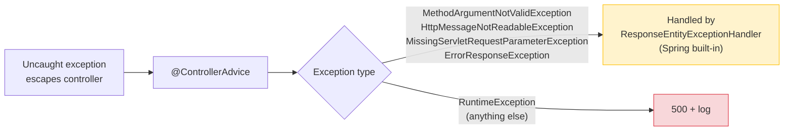

← [Recipes Index](../how-to.md)

# Controllers & Error Handler

- [REST Controllers](#rest-controllers)
- [Global Error Handler — @ControllerAdvice](#global-error-handler--controlleradvice)
- [Adding a New Endpoint (end-to-end)](#adding-a-new-endpoint-end-to-end)

---

## REST Controllers

### When

A controller exposes a use case over HTTP. It is a **humble object**: its only job is to translate HTTP requests into use case calls and use case results into HTTP responses. Zero business logic.

The controller, its request DTO, and its response DTO all live in the **same file**. DTOs are **nested classes** inside the controller — this keeps names short (`RequestDto`, `ResponseDto`) and scopes them naturally (`CreateConversationController.RequestDto`). Use `@Schema(name = "CreateConversationRequest")` so Swagger shows an explicit, readable name instead of the nested class path. The controller maps `Either.Error` variants directly to `ResponseEntity` — no throw. The controller is also where custom business metrics live — it sees the full `Either` result and emits the appropriate counter per variant. See [Error Handling](./error-handling.md) for why business methods return `Either` instead of throwing.

### Template

**Controller:**
```kotlin
// infrastructure/inbound/ConversationController.kt
@RestController
@RequestMapping("/api/v1/conversations")
@Tag(name = "Conversations", description = "Conversation management")
class ConversationController(
    private val createConversation: CreateConversation,
    private val metrics: MetricService,
) {

    @PostMapping
    @Operation(summary = "Open a new conversation")
    @ApiResponses(value = [
        ApiResponse(responseCode = "201", description = "Conversation created",
            content = [Content(schema = Schema(implementation = ResponseDto::class))]),
        ApiResponse(responseCode = "400", description = "Invalid request"),
        ApiResponse(responseCode = "422", description = "Business rule violation")
    ])
    fun create(
        @Parameter(hidden = true) @CommonHeaders commonHeaders: CustomerInformation,
        @RequestBody @Valid request: RequestDto,
    ): ResponseEntity<out Any> =
        when (val result = createConversation(commonHeaders, request.customerId, request.subject)) {
            is Either.Success -> {
                metrics.increment(ConversationCreatedMetric(SUCCESS))
                ResponseEntity.status(HttpStatus.CREATED).body(ResponseDto.from(result.value))
            }
            is Either.Error -> {
                metrics.increment(ConversationCreatedMetric(FAILURE))
                result.value.toResponseEntity()
            }
        }

    @Schema(name = "CreateConversationRequest")
    data class RequestDto(
        @Schema(description = "Customer identifier", example = "CUST-001")
        @field:NotBlank(message = "customerId is required")
        val customerId: String,

        @Schema(description = "Conversation subject", example = "Billing issue")
        @field:NotBlank(message = "subject is required")
        val subject: String
    )

    @Schema(name = "CreateConversationResponse")
    data class ResponseDto(
        val id: String,
        val customerId: String,
        val subject: String,
        val status: String,
        val createdAt: String
    ) {
        companion object {
            fun from(dto: ConversationDTO): ResponseDto =
                ResponseDto(dto.id, dto.customerId, dto.subject, dto.status, dto.createdAt)
        }
    }
}
```

> **File layout:** controller class (with nested `RequestDto` + `ResponseDto`) → private extension functions. One file, one endpoint surface. `@Schema(name = ...)` gives Swagger a human-readable name instead of the nested class path.

The **response DTO** exists separately from the **use-case DTO** because they serve different consumers. The use-case DTO is the application boundary — stable, framework-free. The response DTO is the **API contract** — versioned, annotated with `@Schema`, and free to evolve independently (e.g. renaming a JSON field without touching the use case).

**Domain error → infrastructure error mapping:**

Each adapter is responsible for translating the domain's sealed error into the error type that makes sense for its transport. A REST controller maps errors directly to `ResponseEntity` — no exception throwing needed. An SQS listener might rethrow to trigger a retry; a gRPC adapter would map to `io.grpc.Status`. The domain error is transport-agnostic — the adapter decides how to represent it.

```kotlin
// This extension function lives in the controller file — it is the adapter's responsibility,
// not the domain's. ResponseEntity is returned directly — no throw, no exception overhead.
private fun CreateConversationDomainError.toResponseEntity(): ResponseEntity<out Any> = when (this) {
    is CreateConversationDomainError.CustomerNotFound -> ResponseEntity.status(HttpStatus.NOT_FOUND).build()
    is CreateConversationDomainError.InvalidInput     -> ResponseEntity.status(HttpStatus.UNPROCESSABLE_ENTITY).build()
}
```

### Anti-patterns

```kotlin
// ❌ Missing @CommonHeaders — caller identity not propagated to the use case
fun create(@RequestBody @Valid request: RequestDto): ResponseEntity<out Any>
// ✅ Always include @CommonHeaders — name the parameter commonHeaders, not customerInformation
//    (CustomerInformation is the type, but the caller may be a customer or an agent)
fun create(
    @Parameter(hidden = true) @CommonHeaders commonHeaders: CustomerInformation,
    @RequestBody @Valid request: RequestDto,
): ResponseEntity<out Any>

// ❌ Business logic in the controller
fun create(request: RequestDto): ResponseEntity<*> {
    if (request.subject.length > 200) return ResponseEntity.badRequest()...  // belongs in Conversation.create()
}

// ❌ Returning a domain entity directly — leaks the domain model
fun findById(id: String): ResponseEntity<Conversation>

// ❌ Intermediate exception class between domain error and HTTP status
sealed class CreateConversationApplicationException(...) : SomeBaseException(statusCode)
// ✅ Map sealed error directly to ResponseEntity in the controller — no intermediate class

// ❌ Controller in flat infrastructure/ package (not inbound/)
package de.tech26.valium.chat.infrastructure  // wrong
package de.tech26.valium.chat.infrastructure.inbound  // correct

// ❌ Request/Response DTOs as top-level classes or in separate files
data class CreateConversationRequest(...)  // should be nested inside the controller
// ✅ Nested: class ConversationController { data class RequestDto(...) }
// CreateConversationRequest.kt  ← wrong, separate file
// ConversationResponse.kt       ← wrong, separate file
// ✅ All three classes in ConversationController.kt

// ❌ Logging or metrics in the use case — observability belongs in infrastructure
// See: Observability recipe for the full reasoning
@Service
class CreateConversation(private val metrics: MetricService) {  // wrong
    operator fun invoke(...) {
        logger.info("Creating conversation...")  // wrong
        metrics.increment(ConversationCreatedMetric(SUCCESS))  // wrong
    }
}
```

### See also

- [Architecture Principles — Humble Object Pattern](../architecture-principles.md#46-humble-object-pattern)
- [Error Handling](./error-handling.md) for the Either error handling pattern
- [Observability — Logs and Metrics](./infrastructure.md#observability--logs-and-metrics) for why metrics live in the controller, not the use case
- Production reference: [`CreateConversationController.kt`](https://github.com/n26/valium/blob/main/service/src/main/kotlin/de/tech26/valium/conversation/infrastructure/inbound/CreateConversationController.kt)

---

## Global Error Handler — @ControllerAdvice

The `@ControllerAdvice` is a **safety net**, not a business-error router. Business errors flow through `Either` and are mapped directly to `ResponseEntity` in the controller (see [Error Handling](./error-handling.md)). The `@ControllerAdvice` only catches **unexpected exceptions** — infrastructure crashes and bugs.

### What it catches



Spring's `ResponseEntityExceptionHandler` already handles validation errors (`MethodArgumentNotValidException`, `HttpMessageNotReadableException`, `MissingServletRequestParameterException`) and `ErrorResponseException` with Problem Details format — no need for explicit `@ExceptionHandler` methods for those. Our `@ControllerAdvice` extends it and only adds the catch-all for unexpected `RuntimeException`s.

### Response format — RFC 9457 Problem Details

Every error response uses Spring's `ProblemDetail`:

```json
{
  "type": "/problems/internal-server-error",
  "title": "Internal Server Error",
  "status": 500,
  "detail": "Something went wrong, please try again",
  "instance": "/api/conversations/abc-123/close"
}
```

| Field | Purpose |
|---|---|
| `type` | URI identifying the error category (not a resolvable URL) |
| `title` | Human-readable summary of the error type |
| `status` | HTTP status code |
| `detail` | Human-readable explanation for this occurrence — **never** stack traces, class names, or SQL |
| `instance` | Request URI (Spring fills this automatically) |

### Template

The handler extends `ResponseEntityExceptionHandler` — Spring's base class that already handles validation errors, missing parameters, and `ErrorResponseException` with Problem Details format. We only add the catch-all for unexpected `RuntimeException`s.

```kotlin
// shared/http/errorhandling/CommonErrorHandler.kt
@RestControllerAdvice
class CommonErrorHandler : ResponseEntityExceptionHandler() {

    // Everything else → 500 + log
    @ExceptionHandler(RuntimeException::class)
    fun handleInternalServerError(ex: RuntimeException): ResponseEntity<ProblemDetail> {
        val status = HttpStatus.INTERNAL_SERVER_ERROR

        logger.error(
            context = "ExceptionHandling",
            message = "Unhandled exception occurred while processing request",
            extraData = mapOf("status" to status.value()),
            throwable = ex,
        )

        return ErrorResponseEntity.forStatusAndDetail(
            status,
            "Something went wrong, please try again",
        )
    }
}
```

The catch-all is the **last resort** — every exception that reaches it is unexpected. If you need additional metrics on unhandled exceptions, add a `metricService.increment(...)` call inside the handler.

### Anti-patterns

```kotlin
// ❌ Exposing internal details in error responses
problem.detail = throwable.stackTraceToString()  // leaks internals
// ✅ Generic message for clients, full stack trace in server log only

// ❌ Explicit handlers for MethodArgumentNotValidException, HttpMessageNotReadableException, etc.
@ExceptionHandler(MethodArgumentNotValidException::class)
fun handleMethodArgumentNotValid(ex: MethodArgumentNotValidException) = ...
// ✅ Extend ResponseEntityExceptionHandler — Spring handles these with Problem Details automatically

// ❌ Business errors (404, 403, 409) routed through @ControllerAdvice
@ExceptionHandler(ConversationBusinessDomainException::class)
fun handle(error: ConversationBusinessDomainException) = ...
// ✅ Business errors flow through Either → toResponseEntity() in the controller — never reach @ControllerAdvice
```

### Golden rules

1. **Exhaustive `when` — no `else` branch** in the controller's error mapping. The compiler catches missing variants.
2. **Extend `ResponseEntityExceptionHandler`** — Spring handles validation errors, missing parameters, and `ErrorResponseException` with Problem Details automatically.
3. **Only add a catch-all `@ExceptionHandler`** for unexpected `RuntimeException` — log and return 500.
4. **Never expose stack traces, class names, or SQL** in the HTTP response.
5. **No `try/catch` in use cases for infrastructure failures** — let them propagate. See [Error Handling](./error-handling.md).

### See also

- [Error Handling](./error-handling.md) for the business error flow (`Either`) and layer-by-layer walkthrough
- [Observability — Logs and Metrics](./infrastructure.md#observability--logs-and-metrics) for request logging filters and where metrics live

---

## Adding a New Endpoint (end-to-end)

This recipe walks you through adding a complete endpoint from scratch. Each step links to the relevant recipe.

### Steps

**Step 1 — Model the domain (if new concept)**

If the feature introduces a new domain concept with identity and lifecycle, create an aggregate:
- See [Aggregate Roots](./domain.md#aggregate-roots)

If it's a new operation on an existing aggregate, add a business method to the aggregate root.

**Step 2 — Define errors**

Decide which error pattern fits each failure mode (entity invariant vs expected business outcome):
- See [Error Handling](./error-handling.md)

**Step 3 — Implement the use case**

One use case class per business operation:
- See [Use Cases](./use-cases.md)
- Put `@Transactional` here — see [Transactions](./use-cases.md#transactions)

**Step 4 — Create the controller**

Expose the use case via HTTP. Controller, request DTO, and response DTO live in a single file:
- See [REST Controllers](#rest-controllers)

**Step 5 — Write mandatory tests**

| Test | Mandatory? |
|---|---|
| Use case unit tests | Yes |
| Controller tests (`@WebMvcTest`) | Yes |
| Repository integration tests | Yes (if new repository) |
| BDD feature tests | Yes |

- See [Testing by Layer](./testing.md)
- See [Testing Strategy](../testing-strategy.md)

**Step 6 — Add infrastructure repository (if new aggregate)**

- See [Repositories](./repositories.md)

### Checklist

```
[ ] Aggregate or entity updated with new behavior
[ ] Domain errors defined (invariant exceptions and/or sealed Either errors)
[ ] Use case created with @Transactional, returns Either<DomainError, DTO>
[ ] Controller in infrastructure/inbound/ — humble object, no business logic
[ ] Controller maps Either.Error via exhaustive when (no else) → ResponseEntity directly
[ ] toResponseEntity() extension in the controller file
[ ] Use case unit tests cover happy path + all error paths
[ ] Controller tests cover all HTTP status codes the controller can return
[ ] Integration test for repository (if new)
[ ] BDD feature test with Gherkin scenarios for acceptance criteria
```

### See also

- [Architecture Principles — Adding a New Aggregate](../architecture-principles.md#81-adding-a-new-aggregate)
