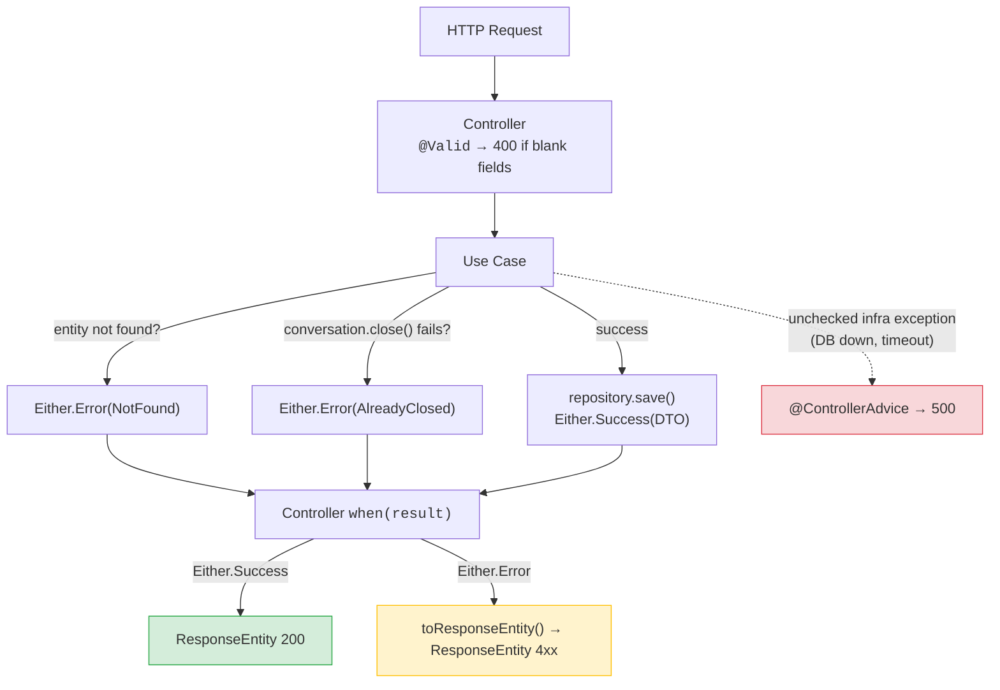

← [Recipes Index](../how-to.md)

# Error Handling

### Decision table

Choose the right mechanism based on *who detects the violation* and *whether the caller can recover*:

| Situation | Mechanism | Where |
|---|---|---|
| Object invariant — must hold regardless of how the object is created (blank name, negative amount) | `require(...)` → throws `IllegalArgumentException` | Entity `init` block |
| Transient parameter — only relevant to one creation path, not stored in the object | `require(...)` → throws `IllegalArgumentException` | Factory method |
| Business rule violation — expected outcome the caller must handle | `Either.Error(SealedError)` returned from entity business method | Entity method |
| Use case orchestration error — entity not found, invalid input from caller | `Either.Error(UseCaseDomainError)` returned from use case | Use case |
| Request field missing or blank (`@field:NotBlank`) | `MethodArgumentNotValidException` (Spring, auto) | Controller `@Valid` |
| Infrastructure failure (DB down, network timeout) | Unchecked exception propagates | `@ControllerAdvice` → 500 |

`Either` is the project's own sealed class at `de.tech26.valium.shared.kernel.Either` — not an external library. It has two variants: `Either.Success<S>` and `Either.Error<E>`.

**The key distinction:** `require` is for programming errors that expose a bug in the caller. `Either` is for business outcomes the caller is expected to handle gracefully.

### Layer-by-layer walkthrough

#### Entity layer — business methods return Either

```kotlin
// domain/Conversation.kt
fun close(): Either<CloseError, Conversation> {
    if (status == ConversationStatus.CLOSED) {
        return Either.Error(CloseError.AlreadyClosed(id, status))
    }
    return Either.Success(copy(status = ConversationStatus.CLOSED))
}

sealed class CloseError {
    data class AlreadyClosed(val id: ConversationId, val current: ConversationStatus) : CloseError()
}
```

`require` validates invariants — conditions that must hold regardless of who constructs the object. Place them in `init` so they run for every construction path (factory, DB mapper, test):

```kotlin
init {
    require(subject.isNotBlank()) { "subject cannot be blank" }
}
```

The **only exception** is when `require` validates a transient factory parameter that is not stored in the object:

```kotlin
companion object {
    fun createPremium(email: Email, profile: UserProfile, paymentMethod: PaymentMethod): User {
        require(paymentMethod.isValid()) { "Valid payment method required for premium" }
        // paymentMethod is used to build Subscription, not stored directly in User
        return User(..., subscription = Subscription.premium(paymentMethod))
    }
}
```

#### Use case layer — maps entity errors to use-case errors

```kotlin
// application/CloseConversation.kt
operator fun invoke(id: UUID): Either<CloseConversationDomainError, ConversationDTO> {
    val conversationId = ConversationId(id)
    val conversation = conversationRepository.findById(conversationId)
        ?: return Either.Error(CloseConversationDomainError.ConversationNotFound(conversationId))

    val closed = conversation.close()
        .mapError { CloseConversationDomainError.AlreadyClosed(conversationId, it.current) }
        .getOrElse { return Either.Error(it) }

    return Either.Success(conversationRepository.save(closed).toDTO())
}

sealed class CloseConversationDomainError {
    data class ConversationNotFound(val id: ConversationId) : CloseConversationDomainError()
    data class AlreadyClosed(val id: ConversationId, val current: ConversationStatus) : CloseConversationDomainError()
}
```

#### Controller layer — maps Either to ResponseEntity

The controller is a humble object: it delegates immediately and maps the result to HTTP. No business logic here.

```kotlin
// infrastructure/inbound/ConversationController.kt
@PutMapping("/{id}/close")
fun close(@PathVariable id: UUID): ResponseEntity<out Any> =
    when (val result = closeConversation(id)) {
        is Either.Success -> ResponseEntity.ok(result.value)
        is Either.Error -> result.value.toResponseEntity()
    }

private fun CloseConversationDomainError.toResponseEntity(): ResponseEntity<out Any> = when (this) {
    is CloseConversationDomainError.ConversationNotFound ->
        ResponseEntity.status(HttpStatus.NOT_FOUND).build()
    is CloseConversationDomainError.AlreadyClosed ->
        ResponseEntity.status(HttpStatus.CONFLICT).build()
}
```

### Visual flow



### Domain Service error propagation

When a domain service calls aggregate methods, propagate errors explicitly using `mapError`:

```kotlin
fun checkEligibility(account: Account): Either<EligibilityError, Result> {
    val activated = account.activate()
        .mapError { EligibilityError.AccountNotActivatable(account.id) }
        .getOrElse { return Either.Error(it) }

    return Either.Success(Result.from(activated))
}
```

### Why not Either in repositories?

Repository ports return plain types (`Entity?`, `Entity`, `List<Entity>`). Infrastructure failures (DB constraint violation, network timeout) are **not business outcomes** — they are unexpected failures that propagate unchecked to `@ControllerAdvice` → 500. Modeling them as `Either` would pollute every use case with infra concerns the domain should not know about.

```kotlin
// ❌ Either on port signature — forces every use case to handle infra failures as business outcomes
interface OrderRepository {
    fun save(order: Order): Either<PersistenceError, Order>
    fun findById(id: OrderId): Either<PersistenceError, Order?>
}

// Use case now leaks infra concerns into the domain error type
val saved = orderRepository.save(order)
    .getOrElse { return Either.Error(ConfirmOrderError.PersistenceFailure(it.reason)) }

// ✅ Plain return types — not-found is null, infra failures propagate unchecked to @ControllerAdvice
interface OrderRepository {
    fun save(order: Order): Order
    fun findById(id: OrderId): Order?
}

// Use case handles only business outcomes — DB failure becomes a 500 automatically
val order = orderRepository.findById(id)
    ?: return Either.Error(ConfirmOrderError.OrderNotFound(id))
val saved = orderRepository.save(confirmed)  // throws on DB failure → @ControllerAdvice → 500
```

### Why not exceptions for everything?

Exceptions for business outcomes create invisible contracts: the controller must know which exceptions to catch, and the compiler cannot verify exhaustiveness. `Either` makes every failure path explicit — the `when` block in the controller is exhaustive by construction, and the compiler refuses to compile if a variant is unhandled.

### Anti-patterns

```kotlin
// ❌ check() for a business rule — throws unchecked RuntimeException, caller gets 500
fun close(): Conversation {
    check(status != ConversationStatus.CLOSED) { "Already closed" }
    return copy(status = ConversationStatus.CLOSED)
}
// ✅ Return Either so the use case can map to the right HTTP status

// ❌ require() for a business outcome — the user can legitimately trigger this
fun cancel(): Conversation {
    require(status.canBeCancelled()) { "Cannot cancel" }
    return copy(status = ConversationStatus.CANCELLED)
}
// ✅ if (!status.canBeCancelled()) return Either.Error(CancelError.InvalidStatus(status))

// ❌ require() for object state outside init — won't run when loading from DB
companion object {
    fun create(customerId: String, subject: String): Conversation {
        require(customerId.isNotBlank()) { "Customer ID cannot be blank" }
        return Conversation(...)
    }
}
// ✅ Move to init — validates on every construction path
init {
    require(customerId.isNotBlank()) { "Customer ID cannot be blank" }
}

// ❌ PersistenceFailure as a domain sealed error — domain must not know infra exists
sealed class CloseConversationDomainError {
    data class PersistenceFailure(val reason: String) : CloseConversationDomainError()
}
// ✅ Let DB exceptions propagate unchecked to @ControllerAdvice → 500

// ❌ HTTP status codes in domain sealed errors — infrastructure concern in domain layer
sealed class CreateError {
    data class NotFound(val code: Int = 404) : CreateError()
}
// ✅ The controller decides HTTP status; the domain only names what went wrong

// ❌ Mixing throw and Either in the same operation
fun create(entity: Entity): Either<Error, Entity> {
    if (invalid) throw SomeException()     // never throw inside an Either-returning function
    return Either.Success(entity)
}

// ❌ Swallowing entity errors in the use case
val closed = conversation.close().getOrElse { return Either.Success(conversation.toDTO()) }
// ✅ Map the error to the appropriate use-case error variant
```

### Golden rules

1. `require` in `init` for object state invariants. Only exception: transient factory parameters not stored in the object.
2. Business methods that can fail return `Either<SealedError, Entity>` — never `require` or `check` for outcomes the user can trigger.
3. Use cases map entity errors with `mapError` — never swallow them.
4. Controllers map sealed errors to `ResponseEntity` directly — no throw, no `ApplicationException` intermediate.
5. `PersistenceFailure` is never a sealed error variant.

### See also

- [Architecture Principles — Infrastructure Layer](../architecture-principles.md#23-infrastructure-layer-adapters) for the controller `when` block
- [Global Error Handler](./controllers.md#global-error-handler--controlleradvice) for what happens when exceptions are not caught by `Either`
- [Use Cases](./use-cases.md) for how use cases orchestrate `Either` with `mapError` and `getOrElse`
- [Domain](./domain.md) for entity design and `require` in `init` blocks
