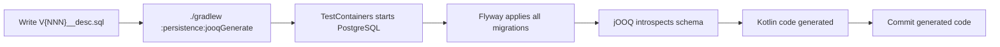

← [Recipes Index](../how-to.md)

# Infrastructure Recipes

- [Infrastructure Services — When No Use Case Is Needed](#infrastructure-services--when-no-use-case-is-needed)
- [Observability — Logs and Metrics](#observability--logs-and-metrics)
- [Database Migrations with Flyway](#database-migrations-with-flyway)

---

## Infrastructure Services — When No Use Case Is Needed

### When

Use this pattern when the operation is **pure infrastructure plumbing** with no business rules and no domain state changes. A use case exists to orchestrate domain logic — when there is none, creating an empty use case adds a layer with no value.

### Decision criterion

| Question | Answer | Action |
|---|---|---|
| Does the operation read or mutate domain state? | Yes | Use case required |
| Are there business rules to enforce? | Yes | Use case required |
| Is it pure operational plumbing? (redrives, metrics, health, retries) | Yes | Direct infra coordination OK |

### Template — Scheduler triggering a redrive (no use case)

A scheduler in `inbound/` calls a redrive processor in `inbound/` (or `outbound/`). No domain objects are created, no business rules evaluated — the scheduler simply moves messages from a DLQ back to the main queue.

```kotlin
// infrastructure/inbound/schedulers/ConversationCloseRedriveScheduler.kt
@Component
class ConversationCloseRedriveScheduler(
    private val conversationCloseRedrive: SQSConversationCloseRedrive
) {
    @Scheduled(cron = "0 0/10 * * * ?")
    @SchedulerLock(name = "conversationCloseReprocessing", lockAtMostFor = "9m", lockAtLeastFor = "5m")
    fun work() = conversationCloseRedrive.reprocess()
}
```

No use case, no domain types — the scheduler and redrive processor are both infrastructure components coordinating directly.

### Template — Scheduler calling a use case (domain logic)

When the scheduled operation involves domain logic, it **must** delegate to a use case:

```kotlin
// infrastructure/inbound/schedulers/CertificatePinningKeysUpdateScheduler.kt
@Component
class CertificatePinningKeysUpdateScheduler(
    private val updateCertificatePinningKeys: UpdateCertificatePinningKeysUseCase
) {
    @Scheduled(fixedDelay = 3600000)
    @SchedulerLock(name = "certificatePinningKeysUpdate", lockAtMostFor = "55m", lockAtLeastFor = "30m")
    fun work() = updateCertificatePinningKeys()
}
```

The scheduler is still humble — it only triggers. All domain logic lives in the use case.

### Anti-patterns

```kotlin
// ❌ Use case that does nothing but forward to infrastructure
class ReprocessDeadLettersUseCase(
    private val redrive: ConversationCloseRedrive
) {
    operator fun invoke() = redrive.reprocess()  // empty wrapper — no domain logic
}

// ❌ Business logic in a scheduler — should be in a use case
@Scheduled(cron = "0 0 3 * * ?")
fun work() {
    val conversations = repository.findExpired()  // domain query
    conversations.forEach { it.close() }          // domain mutation
    repository.saveAll(conversations)              // bypasses use case
}

// ❌ Scheduler calling repository directly for domain operations
@Scheduled(fixedDelay = 60000)
fun work() {
    repository.deleteOlderThan(Instant.now().minus(Duration.ofDays(30)))  // domain decision in infra
}
```

### See also

- [Architecture Principles — Infrastructure Layer](../architecture-principles.md) for the decision criterion
- [SQS Queues](./messaging.md) for the redrive processor pattern

---

## Observability — Logs and Metrics

### When

Use this recipe whenever you need to add logging or metrics to a feature. Observability is an infrastructure concern — it never lives in the use case.

The reasoning is simple: if you keep `MetricService` out of the use case, the use case has fewer dependencies, its tests only break when business logic changes, and you never need `justRun { metrics.increment(any()) }` in every test. The `Either` result already carries the full business context — whoever receives it can log or emit the correct metric.

### Decision guide

| Situation | Where to put metrics |
|---|---|
| Use case has 1 entry point (most cases) | Controller / entry point |
| Multiple entry points, same metric needed | Decorator wrapping the use case |
| Multiple entry points, different metrics per channel | Each entry point independently |
| **Never** | Directly in the use case |

| Concern | Owner | Mechanism |
|---|---|---|
| HTTP latency, throughput, error rate | Micrometer auto | `http.server.requests` — zero code, Spring Actuator provides it |
| Request/response logging | `OncePerRequestFilter` | One component covers all endpoints |
| Custom business metrics | Controller / entry point | Sees the full `Either` result |
| Infrastructure error logging | The adapter that failed | Logs its own errors at the failure point |
| Use case | **Nothing** | Pure orchestration of domain logic |

### Template — Controller with metrics (default)

The most common case — one entry point per use case. The controller emits the metric based on the `Either` result:

```kotlin
@RestController
@RequestMapping("/api/conversations")
class ConversationController(
    private val createConversation: CreateConversation,
    private val metrics: MetricService,
) {
    @PostMapping
    fun create(@RequestBody @Valid request: CreateConversationRequest): ResponseEntity<ConversationResponse> =
        when (val result = createConversation(request.customerId, request.subject)) {
            is Either.Success -> {
                metrics.increment(ConversationCreatedMetric(SUCCESS))
                ResponseEntity.status(HttpStatus.CREATED).body(ConversationResponse.from(result.value))
            }
            is Either.Error -> {
                metrics.increment(ConversationCreatedMetric(FAILURE))
                result.value.toResponseEntity()
            }
        }
}
```

### Template — Request logging filter

`OncePerRequestFilter` is a Spring servlet filter that runs exactly once per HTTP request (even on internal forwards or error dispatches). Annotating it `@Component` is enough — Spring Boot auto-registers it in the filter chain so it intercepts **every** request before it reaches any controller:

```
HTTP request
  → RequestLoggingFilter (captures start time)
    → DispatcherServlet → Controller → Use case → Response
  ← RequestLoggingFilter logs: "POST /api/conversations 201 45ms"
```

```kotlin
@Component
class RequestLoggingFilter : OncePerRequestFilter() {
    override fun doFilterInternal(
        request: HttpServletRequest,
        response: HttpServletResponse,
        filterChain: FilterChain,
    ) {
        val start = System.nanoTime()
        try {
            filterChain.doFilter(request, response)  // lets the request continue to the controller
        } finally {
            // always executes — even if the controller threw an exception
            val duration = Duration.ofNanos(System.nanoTime() - start)
            logger.info("{} {} {} {}ms",
                request.method, request.requestURI, response.status, duration.toMillis())
        }
    }
}
```

This replaces every hand-written `logger.info("Received request...")` in controllers or use cases. One component, one log line per request: method, path, status, latency. For richer metrics (percentiles, histograms), Spring Actuator's `http.server.requests` provides them with zero code.

### Business metrics — in the controller, not in a decorator

Business metrics (success/failure counters per operation) live in the controller's `when(Either)` block — see [Controllers](./controllers.md#rest-controllers). No decorator or wrapper class needed. The controller already sees the full `Either` result and emits the appropriate counter per variant.

### Template — Adapter logging its own errors

Infrastructure adapters log their own failures — they have the infrastructure-specific context (HTTP status, SQL error code, response body):

```kotlin
@Component
class CaptanChatbotClient(
    private val captanApi: CaptanApi,
) : ChatbotClient {
    private val logger = LoggerFactory.getLogger(this::class.java)

    override fun initiate(conversation: Conversation, escalationMethod: EscalationMethod) {
        val response = captanApi.initiate(conversation.id, escalationMethod)
        if (!response.isSuccessful) {
            logger.error(
                "Failed to initiate chatbot for conversation={} status={}",
                conversation.id, response.code(),
            )
        }
    }
}
```

### Anti-patterns

```kotlin
// ❌ Metrics in the use case — pollutes business logic with infrastructure
@Service
class CreateConversation(
    private val repository: ConversationRepository,
    private val metrics: MetricService,  // infrastructure dependency in application layer
) {
    operator fun invoke(id: UUID, customerId: String): Either<CreateConversationError, ConversationDTO> {
        logger.info("Creating conversation {} for customer {}", id, customerId)  // redundant with filter
        return repository.save(...)
            .map {
                metrics.increment(ConversationCreatedMetric(SUCCESS))  // wrong layer
                it.toDTO()
            }
    }
}

// ❌ Metrics in BOTH controller and use case — duplication
class CreateConversation(private val metrics: MetricService) { ... }
class ConversationController(private val metrics: MetricService) { ... }
// FAILURE incremented in two different places for different failure paths

// ❌ Manual request logging in every controller — use a filter
@PostMapping
fun create(...): ResponseEntity<...> {
    logger.info("Received POST /api/conversations")  // filter does this
    val result = createConversation(...)
    logger.info("Returning {}", result)  // filter does this
    ...
}
```

### See also

- [Architecture Principles — Observability](../architecture-principles.md#observability--where-logs-and-metrics-belong) for the full reasoning and tradeoff analysis

---

## Database Migrations with Flyway

### When

Write a Flyway migration when you need to:
- Create a new table for a new aggregate or entity
- Add a column to an existing table
- Add an index on an existing table
- Add a unique or foreign key constraint
- Add a new value to a PostgreSQL enum type

Add a Flyway migration whenever a schema change is needed.

### Pipeline — Flyway → jOOQ codegen

Migrations and generated code follow this flow:



**After adding or modifying a migration**, always run:

```bash
./gradlew :persistence:jooqGenerate
```

This starts a disposable PostgreSQL container (via TestContainers), runs all migrations against it, and regenerates the jOOQ model in `persistence/src/main/kotlin/.../jooq/`. The generated code **must be committed** alongside the migration file.

### Naming convention

Files live in `persistence/src/main/resources/db/migration/` and follow the pattern:

```
V{NNN}__{description}.sql
```

Examples:
- `V042__create_conversation.sql`
- `V043__add_priority_to_conversation.sql`
- `V044__create_conversation_message.sql`

Rules:
- `{NNN}` is a zero-padded 3-digit version number, sequential, no gaps.
- Double underscore separates the version from the description.
- Description uses lowercase snake_case.
- Never include ticket numbers in the file name (e.g. no `V042__SXG_1234_...`).

### Table naming convention

Table and enum type names follow this pattern:

| Entity type | Pattern | Example (no prefix) | Example (`tablePrefix: "svc_"`) |
|---|---|---|---|
| Aggregate root | `{tablePrefix}{aggregate}` | `conversation` | `svc_conversation` |
| Child entity | `{tablePrefix}{aggregate}_{entity}` | `conversation_message` | `svc_conversation_message` |
| Enum type | `{tablePrefix}{aggregate}_{enum}` | `conversation_status` | `svc_conversation_status` |

**Rules:**
- The **aggregate root name always leads** — this prevents intra-module collisions when two aggregates share a conceptually similar child (e.g. `conversation_message` vs `ticket_message`).
- `tablePrefix` is configured per module in `ai26/config.yaml` under `flyway.tablePrefix`. Set it when multiple Gradle modules share the same PostgreSQL database. Leave it null when modules have disjoint table names or use separate schemas.
- The prefix applies to every `CREATE TABLE` and `CREATE TYPE` generated by that module.

### Kotlin → SQL type mapping

| Kotlin | PostgreSQL | Notes |
|---|---|---|
| `UUID` | `UUID` | |
| `String` | `TEXT` | Never `VARCHAR` |
| `Instant` | `TIMESTAMPTZ` | Never `TIMESTAMP` |
| `Boolean` | `BOOLEAN` | |
| `Long` | `BIGINT` | |
| `Int` | `INTEGER` | |
| `BigDecimal` | `NUMERIC` | Specify precision: `NUMERIC(19, 4)` |
| Enum (states) | `CREATE TYPE {module}_{name} AS ENUM (...)` | Defined before the table; never `CHECK` |
| `List<String>` | `TEXT[]` | |
| JSON / `Map` | `JSONB` | |

### CREATE TABLE template

Every new table includes three standard audit columns (`id`, `created`, `updated`). Enum types are declared separately before the table. All `-- TODO:` markers must be resolved before the migration runs in production.

```sql
-- V{NNN}__create_{aggregate}.sql
-- Migration: create {aggregate} table
-- Table name: {tablePrefix}{aggregate} — see ai26/config.yaml for tablePrefix.
-- Review all TODO markers before applying.

-- Enum type: {tablePrefix}{aggregate}_{enum}
CREATE TYPE {aggregate}_status AS ENUM (
    'ACTIVE',
    'INACTIVE'
    -- TODO: add additional status values if needed
);

CREATE TABLE {aggregate} (
    id          UUID              NOT NULL,
    -- TODO: add domain columns here; decide NULL vs NOT NULL per column
    status      {aggregate}_status NOT NULL DEFAULT 'ACTIVE',
    created     TIMESTAMPTZ       NOT NULL,
    updated     TIMESTAMPTZ       NOT NULL,

    CONSTRAINT {aggregate}_pkey PRIMARY KEY (id)
    -- TODO: add foreign key constraints if referencing other tables
    -- CONSTRAINT {aggregate}_{col}_fk FOREIGN KEY ({col}) REFERENCES {other_aggregate}(id)
);

-- TODO: add indexes for columns used in WHERE clauses or ORDER BY
-- CREATE INDEX CONCURRENTLY {aggregate}_{col}_idx ON {aggregate} ({col});
```

Constraint naming:
| Constraint | Pattern | Example |
|---|---|---|
| Primary key | `{table}_pkey` | `conversation_pkey` |
| Foreign key | `{table}_{col}_fk` | `conversation_customer_id_fk` |
| Unique | `{table}_{cols}_uk` | `conversation_external_id_uk` |
| Index | `{table}_{cols}_idx` | `conversation_customer_id_idx` |

### ALTER TABLE patterns

#### Add a nullable column (safe — no lock on large tables)

```sql
ALTER TABLE conversation
    ADD COLUMN assignee_id UUID NULL;
-- TODO: add index if queries filter by this column
-- CREATE INDEX CONCURRENTLY conversation_assignee_id_idx ON conversation (assignee_id);
```

#### Add a NOT NULL column to an existing table (requires DEFAULT for online safety)

```sql
-- Add with DEFAULT first — existing rows get the default value immediately
ALTER TABLE conversation
    ADD COLUMN priority TEXT NOT NULL DEFAULT 'NORMAL';

-- TODO: if you do not want a permanent default, drop it after backfill:
-- ALTER TABLE chat_conversation ALTER COLUMN priority DROP DEFAULT;
```

#### Add an index (always CONCURRENTLY to avoid table lock)

```sql
-- CONCURRENTLY builds the index without holding a lock; runs outside a transaction block.
-- Requires flyway.postgresql.transactional.lock = false (already configured in persistence/build.gradle.kts).
CREATE INDEX CONCURRENTLY chat_conversation_customer_id_idx
    ON chat_conversation (customer_id);
```

#### Add a unique constraint

```sql
ALTER TABLE chat_conversation
    ADD CONSTRAINT chat_conversation_external_id_uk UNIQUE (external_id);
```

#### Add a value to an existing enum type

```sql
-- NOTE: ALTER TYPE ... ADD VALUE cannot run inside a transaction block.
-- This works because flyway.postgresql.transactional.lock = false is configured.
ALTER TYPE chat_conversation_status ADD VALUE IF NOT EXISTS 'PENDING';
-- TODO: verify application code handles PENDING before deploying this migration
```

### Online migration safety

Some DDL operations take a full table lock and block reads and writes. The table below summarises each operation and its mitigation.

| Operation | Lock level | Blocks reads? | Blocks writes? | Safe on large tables? | Mitigation |
|---|---|---|---|---|---|
| `CREATE TABLE` | None (new table) | No | No | Yes | — |
| `ADD COLUMN NULL` | Access exclusive (brief) | No | No | Yes | Brief metadata-only lock |
| `ADD COLUMN NOT NULL DEFAULT` | Access exclusive | No | No | Yes | Postgres rewrites only new rows |
| `ADD COLUMN NOT NULL` (no default) | Access exclusive (full rewrite) | Yes | Yes | No | Always add `DEFAULT` |
| `DROP COLUMN` | Access exclusive | No | No | Yes | Marks column invisible; no rewrite |
| `ALTER COLUMN TYPE` | Access exclusive (full rewrite) | Yes | Yes | No | Add new column, backfill, swap, drop old |
| `CREATE INDEX` | Share lock | No | Yes | No | Always use `CREATE INDEX CONCURRENTLY` |
| `CREATE INDEX CONCURRENTLY` | No table lock | No | No | Yes | Cannot run inside a transaction |
| `ADD CONSTRAINT UNIQUE` | Share lock | No | Yes | No | Create unique index first with CONCURRENTLY, then attach |
| `ALTER TYPE ADD VALUE` | Share lock (brief) | No | No | Yes | Cannot run inside a transaction |

### Anti-patterns

```sql
-- ❌ VARCHAR — always TEXT
name VARCHAR(255) NOT NULL

-- ❌ TIMESTAMP — always TIMESTAMPTZ
created TIMESTAMP NOT NULL

-- ❌ CHECK for enum values — always CREATE TYPE
status TEXT CHECK (status IN ('OPEN', 'CLOSED'))

-- ❌ Missing module prefix
CREATE TABLE conversation (...)              -- must be chat_conversation
CREATE TYPE conversation_status AS ENUM (...) -- must be chat_conversation_status

-- ❌ Missing NULL / NOT NULL
customer_id TEXT                             -- always explicit

-- ❌ Plain CREATE INDEX (locks writes)
CREATE INDEX conversation_idx ON chat_conversation (customer_id);

-- ❌ NOT NULL column without DEFAULT on large existing table
ALTER TABLE chat_conversation ADD COLUMN priority TEXT NOT NULL;

-- ❌ H2-compatible SQL (H2 has different type handling from PostgreSQL)
-- Always test against a real PostgreSQL instance (TestContainers in integration tests)
```

### See also

- [Repositories](./repositories.md) for the JOOQ mapping that reads this schema
