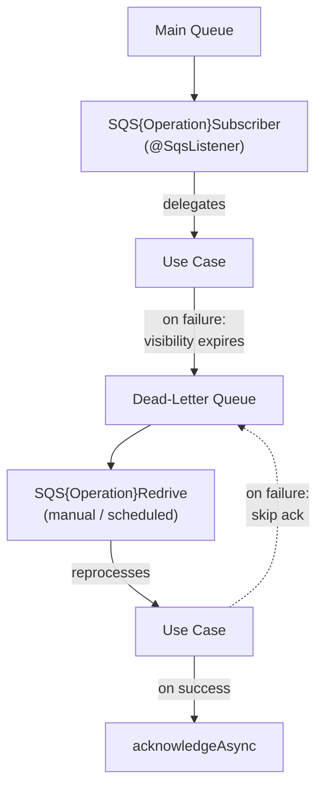

← [Recipes Index](../how-to.md)

# SQS Queues — DLQ and Redrive

### When

Use this recipe when the service needs to communicate via SQS: sending messages to a queue (publisher), consuming messages from a queue (subscriber), or reprocessing failed messages from a dead-letter queue (redrive).

**Payload decision:**

| Payload type | Use when | Publisher sends | Subscriber receives |
|---|---|---|---|
| Simple (string) | The message is a single ID or opaque string | `id.toString()` | `String` — parse inside listener |
| JSON | The message carries structured data | `objectMapper.writeValueAsString(message)` | Deserialized data class directly |

### Architecture



### Template — Publisher

Two files (three for JSON payloads):

**Domain port (zero framework imports):**

```kotlin
// domain/port/ConversationAnalysisSubmitter.kt
interface ConversationAnalysisSubmitter {
    fun submit(conversationId: ConversationId)
}
```

**Publisher (simple string payload):**

```kotlin
// infrastructure/outbound/conversationAnalysis/SQSConversationAnalysisPublisher.kt
@Service
@EnableConfigurationProperties(ConversationSQSProperties::class)
class SQSConversationAnalysisPublisher(
    private val sqsTemplate: SqsTemplate,
    private val properties: ConversationSQSProperties
) : ConversationAnalysisSubmitter {

    @Retry(name = "all")
    override fun submit(conversationId: ConversationId) {
        runCatching {
            sqsTemplate.send {
                it.queue(properties.conversationAnalysisQueueName)
                    .payload(conversationId.value.toString())
            }
        }.onFailure { throw ExternalServiceServerException("Failed to submit analysis: $conversationId", it) }
    }
}
```

**For JSON payloads**, also create `{OperationName}Message` as an `internal data class` and serialize via `ObjectMapper`:

```kotlin
internal data class ConversationAnalysisMessage(val conversationId: String, val customerId: String)
```

### Template — Subscriber

```kotlin
// infrastructure/inbound/conversationAnalysis/SQSConversationAnalysisSubscriber.kt
@Service
class SQSConversationAnalysisSubscriber(
    private val analyseConversation: AnalyseConversation
) {
    private val log = logger()

    @SqsListener(
        value = ["\${conversation.sqs.conversation-analysis-queue-name}"],
        messageVisibilitySeconds = 30
    )
    fun receive(payload: String) {
        log.info("SQSConversationAnalysisSubscriber received: {}", payload)
        runCatching {
            analyseConversation(payload)
        }.onSuccess {
            log.info("SQSConversationAnalysisSubscriber processed: {}", payload)
        }.onFailure { ex ->
            log.error("SQSConversationAnalysisSubscriber failed: {}", payload, ex)
            throw ex  // rethrow — SQS retries the message
        }
    }
}
```

### Template — Redrive

**Simple pattern (extends `SQSRedriveProcessor`):**

```kotlin
// infrastructure/inbound/conversationAnalysis/SQSConversationAnalysisRedrive.kt
@Service
@EnableConfigurationProperties(ConversationSQSProperties::class)
class SQSConversationAnalysisRedrive(
    @Qualifier("sqsTemplateManualAck") sqsTemplate: SqsTemplate,
    private val properties: ConversationSQSProperties,
    private val analyseConversation: AnalyseConversation
) : SQSRedriveProcessor(sqsTemplate) {

    fun redrive() = redrive(properties.conversationAnalysisRedriveQueueName)

    override fun processMessage(payload: String, acknowledgement: Acknowledgement) {
        analyseConversation(payload)
        acknowledgement.acknowledgeAsync()  // only ack on success
    }
}
```

**Complex/JSON pattern (standalone with `ObjectMapper`):** does NOT extend base class; deserializes the payload manually and acknowledges per-message from the headers.

### Template — Configuration Properties

```kotlin
// infrastructure/outbound/conversationAnalysis/ConversationSQSProperties.kt
@ConfigurationProperties(prefix = "conversation.sqs")
data class ConversationSQSProperties(
    val conversationAnalysisQueueName: String,
    val conversationAnalysisRedriveQueueName: String
)
```

`application.yml`:
```yaml
conversation:
  sqs:
    conversation-analysis-queue-name: ""
    conversation-analysis-redrive-queue-name: ""
```

The `sqsTemplateManualAck` bean must be configured in shared infrastructure:

```kotlin
// shared/infrastructure/queue/SQSAutoConfiguration.kt
@Configuration
class SQSAutoConfiguration {
    @Bean("sqsTemplateManualAck")
    fun sqsTemplateManualAck(sqsAsyncClient: SqsAsyncClient): SqsTemplate =
        SqsTemplate.builder()
            .sqsAsyncClient(sqsAsyncClient)
            .configure { it.acknowledgementMode(AcknowledgementMode.MANUAL) }
            .build()
}
```

### Anti-Patterns

```kotlin
// ❌ Business logic in subscriber — belongs in use case
@SqsListener(...)
fun receive(payload: String) {
    if (payload.isEmpty()) return  // domain decision in infrastructure
}

// ❌ Swallowing exceptions in subscriber — SQS will not retry, message lost
runCatching { useCase(payload) }  // missing .onFailure rethrow

// ❌ @SqsListener on redrive — redrive is triggered explicitly, not auto-consumed
@SqsListener(value = [...])
fun redrive(payload: String) { ... }  // wrong

// ❌ Auto-acknowledge in redrive — message removed even if processing fails
// Use @Qualifier("sqsTemplateManualAck") and acknowledgement.acknowledgeAsync() manually

// ❌ Acknowledging before successful processing
acknowledgement.acknowledgeAsync()
useCase(payload)  // if this throws, message already gone from DLQ

// ❌ No @Retry on publisher — transient SQS failures not retried
override fun submit(id: ConversationId) {
    sqsTemplate.send { it.queue(queueName).payload(id.toString()) }  // no @Retry
}

// ❌ Hardcoded queue names
sqsTemplate.send { it.queue("my-hardcoded-queue").payload(...) }
```
