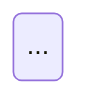

# ai26-design-user-story

Collaborative design conversation that produces the complete artefact set for a ticket.
The LLM does not walk through a fixed list of questions — it enters a conversation with
the engineer and architect, writing artefacts progressively as areas are settled.

---

## Step 1 — Load context

Read in this order:
1. `ai26/config.yaml` — stack, modules (base_package, conventions per module)
2. Ticket from Jira via MCP — description, ACs, epic link
3. Parent epic context (`ai26/epics/{EPIC}/prd.md`, `ai26/epics/{EPIC}/architecture.md`) if exists
4. `ai26/context/DOMAIN.md`
5. `ai26/context/ARCHITECTURE.md`
6. `ai26/context/DECISIONS.md` (if exists)
7. `ai26/context/DEBT.md` (if exists)
8. `docs/architecture/modules/{module}/` — existing module docs (if module known)
9. `docs/adr/` — existing ADRs (titles only)
10. `ai26/features/{TICKET}/` — existing artefacts if any (partial work or adoption scenario)

### Module resolution

From `ai26/config.yaml`, identify the target module(s) for this ticket:

1. If the ticket or invocation explicitly names a module — use it.
2. If only one module has `active: true` — use it without asking.
3. If multiple modules are `active: true` — infer from the ticket's bounded context,
   then confirm:

       Target module inferred: {name} ({path})
       Is this correct, or does this ticket also touch another module?

4. If a non-active (legacy) module is involved — warn before proceeding:

       This ticket appears to touch {name}, which is marked active: false.
       Proceed with caution. Confirm to continue.

The resolved module(s) determine: `base_package`, `conventions`, `flyway` settings,
and `docs/architecture/modules/{module}/` path used throughout the skill.

If any required context file is missing (`DOMAIN.md`, `ARCHITECTURE.md`, `DECISIONS.md`,
`DEBT.md`, `INTEGRATIONS.md`), warn before starting:

    Context file {file} not found.
    The design conversation can proceed, but decisions may lack context.
    Do you want to create it first (/ai26-onboard-team), or continue without it?

### If partial artefacts exist

Show what was found and ask how to proceed:

    Found existing design workspace for {TICKET-ID}:
    ✓ domain-model.yaml
    ✓ use-case-flows.yaml
    ✗ error-catalog.yaml — missing
    ✗ scenarios/ — missing

    A. Continue from where this left off
    B. Review existing artefacts first
    C. Start fresh (confirm before overwriting)

---

## Step 2 — Open the conversation

Greet with a brief summary of what was loaded:

    I've read {TICKET-ID}: "{ticket title}".

    Context loaded:
    - {N} existing domain concepts in scope
    - {N} relevant ADRs
    - {debt area warnings if any}

    {first question or observation using configured interaction style}

### Lightweight epic analysis (when no epic architecture exists)

If `ai26/epics/{EPIC}/architecture.md` does not exist, perform inline analysis as the
conversation develops:
- Detect which existing aggregates are touched when they come up
- Flag DEBT.md areas when the conversation touches them
- Surface external dependencies as they are mentioned
- Open ADR conversations when architectural decisions arise

If a significant risk is detected, recommend pausing:

    This feature touches {area} which is marked RISK: alto in DEBT.md.
    I recommend running /ai26-design-epic-architecture {EPIC} before continuing.
    Do you want to proceed anyway?

---

## Step 3 — Design conversation

Drive the conversation to cover all configured artefact areas. Let the conversation
flow naturally — do not mechanically go through phases. Cover:

- Domain model (aggregates, states, methods, invariants)
- Use cases (inputs, outputs, error paths, side effects)
- Error catalog (derived from use case error paths)
- API contracts (endpoints, if feature has HTTP surface)
- Events (published and consumed, if feature has event interactions)
- Glossary (new domain terms introduced)
- Ops checklist (migrations, feature flags, observability)

### Decision detection

Monitor for decision moments throughout the conversation:
- Human asks "what are the options?"
- Human expresses uncertainty: "I'm not sure whether to..."
- Human asks for trade-offs
- Human changes their mind mid-conversation

When a decision is resolved (human commits to a direction):

    That decision is worth capturing. Should I document it as an ADR?

Classification:
1. Already in `ai26/context/DECISIONS.md`? → apply as constraint, do not re-debate
2. Already in `docs/adr/`? → surface the ADR, check if current case deviates
3. Global policy (applies beyond this feature)? → propose adding to `ai26/context/DECISIONS.md`
4. Feature-specific architectural trade-off (domain modelling, data modelling, inter-component communication, infrastructure)? → propose ADR

When the engineer says yes to an ADR, draft it inline:

    # ADR-{date}: {title}

    ## Status
    Accepted

    ## Context
    {situation}

    ## Decision
    {what was decided}

    ## Options considered
    ### Option A — {name}
    Pros: ... Cons: ...
    ### Option B — {name}
    Pros: ... Cons: ...

    ## Reasons for this decision
    {why this option}

    ## Consequences
    {what changes}

    ## Ticket
    {TICKET-ID}

    Confirm to write this ADR?

On confirmation, write and commit immediately:
```
git add docs/adr/{date}-{slug}.md
git commit -m "{TICKET-ID} adr: {title}"
git push
```

### Deferred decisions

If the engineer defers a decision, track it internally.
Surface it at completeness check if still unresolved.

---

## Step 4 — Write artefacts progressively

Write artefacts as each area is settled — do not wait until the end.

After writing each artefact:

    ✓ {artefact-name} written.
    You can review it now or continue. Say "show it" or "continue".

Wait for the engineer's response before proceeding.

If the engineer revisits a settled topic via conversation, show a diff and confirm before updating:

    That changes what we settled earlier. I'll update {artefact}:

    - {old value}
    + {new value}

    Confirm?

### Direct file edits

If the engineer edits an artefact directly outside the conversation:

    Human: I edited domain-model.yaml directly. Please re-read it.

Re-read the file, diff against in-memory state, summarise changes, and surface consequences:

    I see the following changes in domain-model.yaml:
    - {change 1}
    - {change 2}

    Consequences:
    - {affected artefact}: {what needs updating}

    Should I apply those updates now, or do you want to handle them?

### Artefact formats

Write to `ai26/features/{TICKET}/` following the schemas in `docs/ai26-sdlc/reference/artefacts.md`.

Commit after each artefact:
```
git add ai26/features/{TICKET}/{artefact-name}
git commit -m "{TICKET-ID} design: {artefact description}"
git push
```

Commit messages per artefact:
- `{TICKET-ID} design: domain model`
- `{TICKET-ID} design: use case flows`
- `{TICKET-ID} design: error catalog`
- `{TICKET-ID} design: API contracts`
- `{TICKET-ID} design: events`
- `{TICKET-ID} design: Gherkin scenarios`
- `{TICKET-ID} design: ops checklist`
- `{TICKET-ID} design: diagrams`

### Mermaid diagrams (`diagrams.md`)

Generate `diagrams.md` as the final artefact, after all other areas are settled.
Include only the diagram types that add developer value for this specific ticket.

**Diagram selection rules:**

| Diagram type | Include when |
|---|---|
| Domain class diagram | Ticket introduces or modifies aggregates, entities, or value objects |
| State machine diagram | Aggregate has a lifecycle with states and transitions |
| Sequence diagram (use case) | Use case crosses two or more components (controller → use case → repository, or inter-context calls) |
| Sequence diagram (event flow) | Ticket emits or consumes domain events |
| Component diagram | Ticket introduces a new bounded context or a new external dependency |
| ER diagram | Ticket has Flyway migrations that create or alter tables |

Only include a diagram if it shows something that is not already obvious from the YAML
artefacts. A single-step use case does not need a sequence diagram.

**Format:**

```markdown
# Diagrams — {TICKET-ID}: {title}

## Domain class diagram

```mermaid
classDiagram
  ...
```

## State machine — {AggregateName}



## Sequence — {Use case name}

```mermaid
sequenceDiagram
  ...
```

## Event flow — {EventName}

```mermaid
sequenceDiagram
  ...
```

## ER diagram

```mermaid
erDiagram
  ...
```
```

**Naming conventions inside diagrams:**
- Use actual class/field names from `domain-model.yaml` — no invented names.
- Sequence diagram participants: `Client`, `Controller`, `UseCase`, `Repository`,
  `EventPublisher`, `ExternalService` — use real class names when known.
- State diagram states match aggregate status enum values exactly.
- Class diagrams show only the fields and methods relevant to this ticket — not the full
  aggregate if only one method changed.

After writing `diagrams.md`:

    ✓ diagrams.md written — {list of diagram types generated}.
    You can review them now or continue. Say "show it" or "continue".

---

## Step 5 — Completeness check

When all configured artefacts are written, run cross-reference validation:

1. Every `errorCase` in `use-case-flows.yaml` has an entry in `error-catalog.yaml`
2. Every endpoint in `api-contracts.yaml` references a `useCase` in `use-case-flows.yaml`
3. Every event side effect in `use-case-flows.yaml` has an entry in `events.yaml`
4. Every scenario in `scenarios/` covers at least the happy path and one error path
5. Every domain term used in `domain-model.yaml` appears in `glossary.yaml`
6. Every Jira AC has at least one corresponding scenario
7. `diagrams.md` exists and class/state names match `domain-model.yaml` exactly

Report violations as warnings. The engineer must resolve them before the design phase closes.

Surface any deferred decisions:

    Open decisions not yet documented:
    - {decision} (deferred during {phase})
    These must be resolved or explicitly accepted as risk before implementation.

---

## Step 6 — Close

    Design complete for {TICKET-ID}.

    Artefacts written:
    {list of files — must include diagrams.md}

    Diagrams generated:
    {list of diagram types in diagrams.md, e.g. "class, state machine, sequence (UC-1), ER"}

    ADRs written:
    {list, or "none"}

    Context updates proposed:
    {list, or "none"}

    Open items:
    {any warnings or deferred decisions}

    Next step: /ai26-implement-user-story {TICKET-ID}
